System Center Configuration Manager Solution Template Documentation
-------------------------------------------------------------------

# Table of Contents
1. [Introduction](#introduction)
2. [Architecture](#architecture)
3. [System Requirements](#system-requirements)
4. [How to Install](#how-to-install)
5. [Reports Walkthrough](#report-walkthrough)
6. [Technical Description](#technical-description)
7. [Customizing the Template]()


# Introduction


The SCCM solution template provides detailed information of your System Center Configuration Manager including client and server health, malware protection, software updates, and software inventory across your organization.

The template lets you do things like:

-   Compare key System Center Configuration Manager metrics to personalized targets and see how they trend over time

-   Identify trouble spots and get the information you need to understand what needs to be done

The following document provides a walkthrough of installation steps as well as information on cost. For any questions not covered in this document, please contact the team at <PBISolnTemplates@microsoft.com>

# Architecture 


The flow of the SCCM solution template is as follows:

-   Windows task scheduler launches a process that pulls data from your SCCM database each day.

-   The task copies data into Azure SQL (or SQL server)

-   Power BI imports data from Azure SQL (or SQL server) and renders pre-defined reports

# System Requirements

-   System Center 2012 Configuration Manager R2 SP1 (5.00.8239.1000) or later. Read access to System Center Configuration Manager database is required.

-   Destination database: Azure SQL database or SQL Server database (SQL Server 2008 R2 SP3 or later).

-   For the machine where the installation is run,

    -   Microsoft .NET Framework 4.5 or later.

    -   PowerShell version 3.0 or later.

    -   For Operating System: Windows Server 2008 R2 SP1, or later. Windows 7 Professional, Enterprise, or later. Note that Windows 10 anniversary update (1607 or later) is not supported at this moment because of a bug in credential guard.

# How to Install


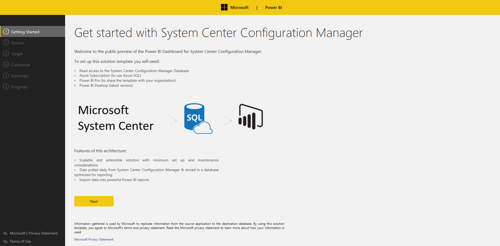

**Step 1: Connect to SCCM database**

Enter a server name for your SCCM database, provide a credential to the server, validate a connection to the server, and choose your SCCM database. Note that the template supports System Center 2012 Configuration Manager R2 SP1 (5.00.8239.1000) or later. The credential used to connect to SCCM will be used to create a scheduled task to pull data from SCCM.

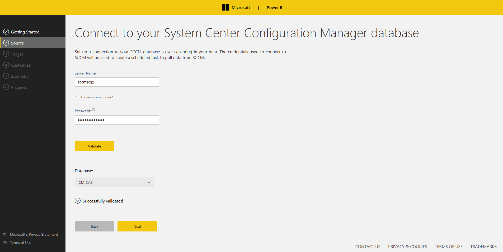

**Step 2: Connect to your destination database**

Enter a server name for your destination database, validate a connection to the server, and choose your database.

-   Option 1 (Azure SQL): SQL user name and password is required.

-   Option 2 (SQL server): either Windows authentication or SQL authentication.

Note that database owner role is required to create tables and execute stored procedures.

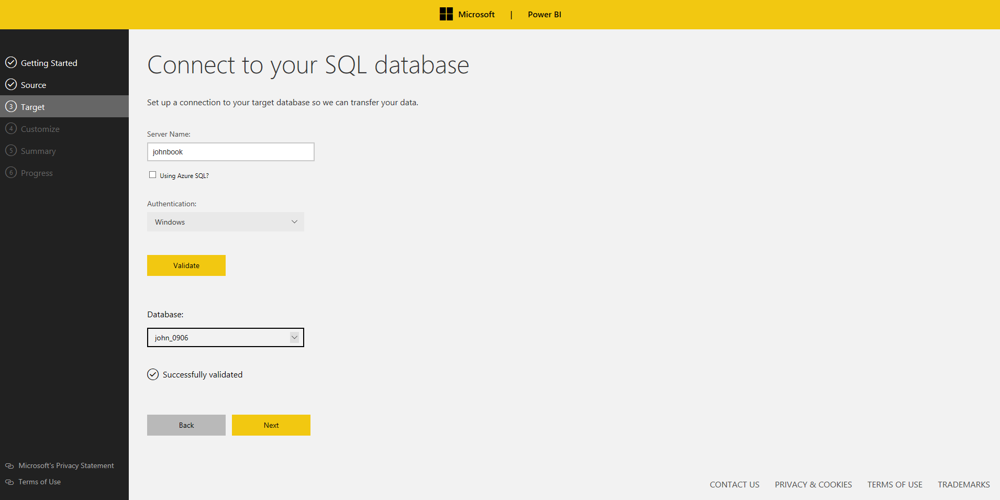

**Step 3: Customize your settings**

Configure the following parameters and click “Validate”.

-   Daily Trigger Time: specify the condition that will trigger the daily task. (at 2:00 AM by default)

-   Data Retention Days: between 1 and 365

-   Endpoint Compliance Target: between 0 and 1

-   Health Evaluation Target: between 0 and 1

Note that the scheduled task will not be triggered if a machine goes to sleep. The task will be restarted as soon as possible when the machine is out of sleep mode.

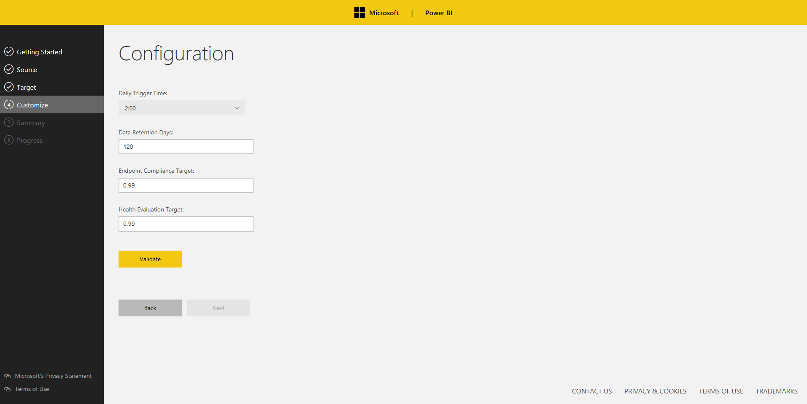

**Step 4: Verify and run**

Verify the information and click “Run”.

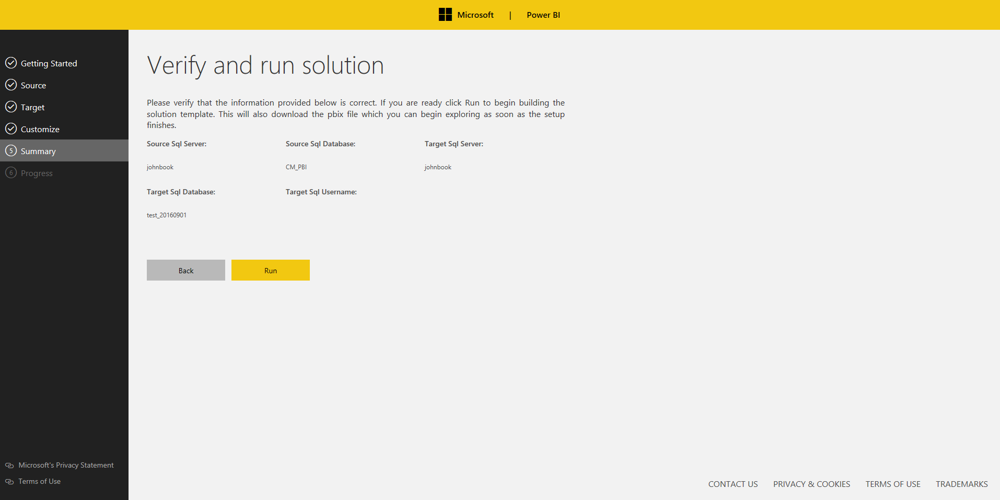

**Step 5: Track your progress**

The setup will create new tables, views, stored procedures in destination database, install required SQL tools if not found, create/run a new task.

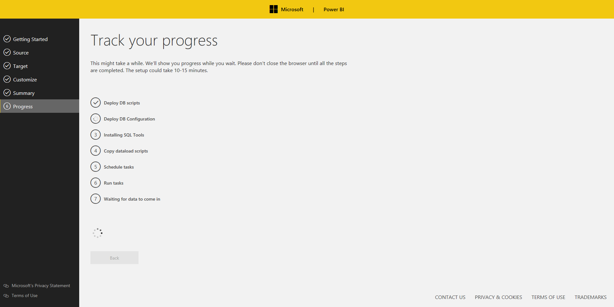

**Step 6: Start pulling data**

We'll show you progress while you wait. Please don't close the browser until all the steps are completed. This might take a while, depending on the size of your SCCM database.

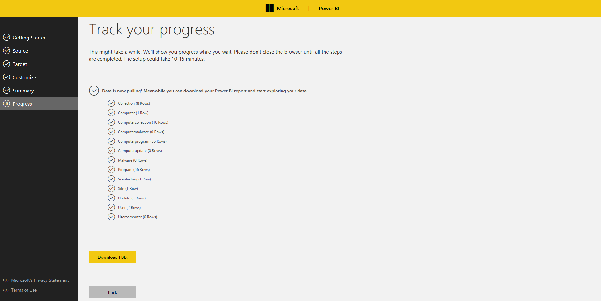

**Step 7: Download PBIX**

Download your Power BI report, open the report, and click “Apply changes” as below. Note that Power BI Desktop is required to open the report (Power BI Desktop can be download from [here](https://powerbi.microsoft.com/en-us/desktop/)).

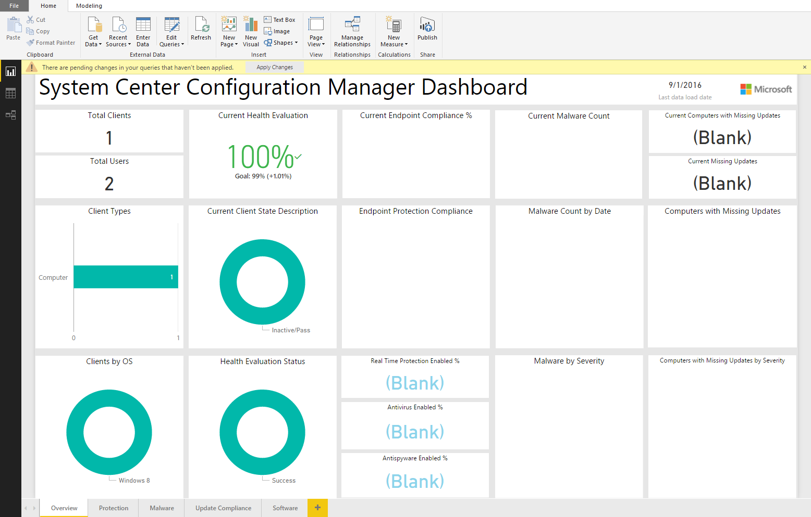

Please click “Refresh” to import data from your destination database and enter your credentials.

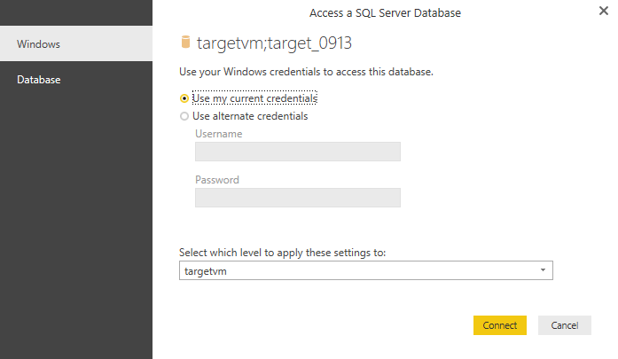

**Step 8: Publish the report to PowerBI.com**

At this point, you should be able to see your SCCM data. If you are interested in publishing the report to [Power BI](https://powerbi.microsoft.com/en-us/) and share it with colleagues, click “Publish” to Power BI.

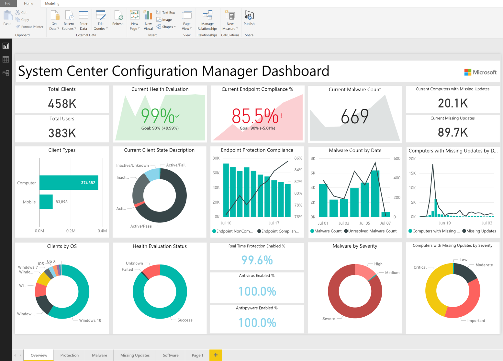

# Reports walkthrough

### Overview:

The report provides a high level overview of key SCCM metrics to quickly identify machines not up-to-date with software updates, failed mitigations to malware infections to be able to act promptly, failed updates and more.


### Protection:

You can track key protection measures for the period you configured during the installation.


### Malware:

The report shows trend of resolved/unresolved malware count by severity, OS, and remediation type. Malware Category chart (lower-left) shows numbers of resolved malware (color saturation by unresolved malware).


Note that you can enable drill down by selecting the arrow icon in the top right corner of the bar chart. To drill down one field at a time, double-click one of the chart bars. For drill down in details, please click [here](https://powerbi.microsoft.com/en-us/documentation/powerbi-service-drill-down-in-a-visualization/).

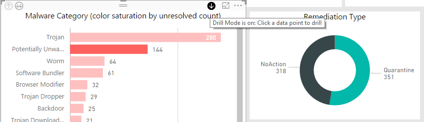

### Update Compliance:

The report lists missing updates by severity and device that can be used to take action.


We provide hyperlinks for the missing updates in the table (lower-left). You can click the urls for more information.

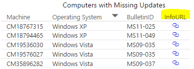

### Software Inventory:

The report allows users to select a machine to show installed programs or select a program to show related machines.


# Technical Description
This section describes each component of the solution template in detail.

## Client Data Extraction and Load

A powershell script dataload.ps1 found in the folder C:\ProgramData\Business Platform Solution Templates\Microsoft-SCCMTemplate 
executes a collection of scripts to pull data from the source SCCM datatbase into a flat file, bcp it to the
destination database, and executes stored procedures in the destination database to merge this data with the results from 
prior loads.

The script is executed from Task Scheduler. To change or pause the schedule, open Task Scheduler and locate the Task "Power BI Solution Template - SCCM". 

The same data is pulled with each load. Destination database stored procedures merge the results.

## Understanding Credentials for Accessing the SCCM and Target Databases

The task requires credentials to be able to access the SCCM and for the target databases. These credentials are securely stored with
Credential Manager.

You can manually manage the credentials for both the SCCM and target database after the solution template
is provisioned. To change the windows credentials used to access the SCCM DB and target database, open task
scheduler, find the task "Power BI Solution Template - SCCM" and change the task's credentials.

To change the credentials used to access the target database when SQL Authentication was used, open Credential Manager (open Control Panel and search for Credential Manager), and edit the credential "pbi_sccm".

## SQL Server DB - SQL Server or Azure SQL Database 
### Tables

The following additional tables are created in to the target database.

<sub>

| Table         |	Description |
| -----         | ------------  |
| collection          | An SCCM custom collection. These are not currently used by the solution template.  |
| computer            | Distinct list of all computers. |
| computercollection  | An SCCM primary or secondary site. |
| computermalware     | Junction table listing which malware is on which computer. |
| computerprogram     | Junction table listing which software is on which computer. |
| computerupdate      | Junction table listing which update is on which computer.  |
| configuration       | Table containing any config values used by the template. |
| date                | A date table created and populated by the solution template |
| malware             | List of all malware detected by SCCM |
| operatingsystem     | List of all operating systems detected by SCCM |
| program             | List of all software detected on the SCCM computers |
| scanhistory         | A history of scan results for each computer |
| site                | Primary and secondary SCCM sites |
| update              | List of all updates installed on the computers |
| user                | List of all users of SCCM computers |
| usercomputer        | Junction table listing which user is associated with each computer |

</sub>

Each table is accompanied by a corresponding staging table with the same name with _temp appended; for example, the site table
has a site_temp table. The structure of the staging table is identical to its counterpart.

All tables are created in the pbist_sccm schema.

#### Collection

<sub>

| Column         | Datatype     |	Description |
| ---------------|--------------|--------------|
| collectionid   | nvarchar(8)  | unique identified of the collection |
| collection name | nvarchar(255) |  |

</sub>

Query to populate collections:

<sub>

```
SELECT SiteID          [CollectionID],      
       CollectionName  [Collection Name]    
FROM   v_Collections

```

</sub>

#### Computer


<sub>

| Column         | Datatype     |	Description |
| ---------------|--------------|--------------|
|	machineid    | int          |  |
|	sitecode   |  nvarchar(3)   | The SCCM site the computer belongs to  | 
|	[name]   |  nvarchar(256)          | Computer name |
|	[operating system]    | nvarchar(256)   |  The operating system name. |
|	[client type]    | tinyint          | 1: computer, 2: mobile |
|	[manufacturer]    | nvarchar(255)          |  The computer manufacturer|
|	[model]    | nvarchar(255)           | Model number. Contain "Virtual Machine" for VMs. |
|	[platform]   |  nvarchar(255)           | eg, x64-based PC, X86-based PC |
|	[physical memory]   |  bigint           | physical memory in bytes |
|	[deleted date]    | datetime           | The date the computer was deleted. Computers are not physically deleted from this table but are marked as deleted with this date. This is the date the computer was first observed to be absent from SCCM. |

</sub>

Query to populate computer:

<sub>

```
WITH hwplatform AS
(
    SELECT resourceid                   MachineID,
           Max(cs.manufacturer0)        Manufacturer,
           Max(cs.model0)               [Model],
           Max(cs.systemtype0)          [Platform],
           Max(cs.totalphysicalmemory0) [Physical Memory]
    FROM   v_gs_computer_system cs
    GROUP  BY resourceid
)
SELECT itemkey                         machineid,
       client.sitecode                 sitecode,
       c.name0                         [name],
       c.operating_system_name_and0 AS [operating system],
       c.client_type0                  [client type],
       hwp.manufacturer,
       hwp.[model],
       hwp.[platform],
       hwp.[physical memory]
FROM   vsms_r_system c
           LEFT JOIN v_clientmachines AS client ON c.itemkey = client.resourceid
           LEFT JOIN hwplatform AS hwp ON c.itemkey = hwp.machineid
WHERE
    decommissioned0=0 AND obsolete0=0 AND c.name0 NOT LIKE N'%|%';

```

</sub>


#### ComputerCollection


<sub>

| Column         | Datatype     |	Description |
| ---------------|--------------|--------------|
| collectionid   | nvarchar(8)  |  |
| resourceid     | int          | |

</sub>

Query populating the table:

<sub>

```
SELECT SiteID          [CollectionID],      
       CollectionName  [Collection Name]    
FROM   v_Collections;
```

</sub>


#### ComputerMalware


<sub>

| Column         | Datatype     |	Description |
| ---------------|--------------|--------------|
|	threatid |  bigint |  Unique identifier of the threat |
|	machineid |  int | |
|	[detection date] |  datetime | date malware detected on the computer. |
|	[observer product name] |  nvarchar(32) | product name detecting the malware, eg, SystemCenter Endpoint Protection |
|	[observer product version] |  nvarchar(255)  | |
|	[observer detection]  | nvarchar(8)  | |
|	[remediation type] |  nvarchar(11) | action taken for remediation |
|	[remediation result] |  nvarchar(5)  | whether or not remediation successful |
|	[remediation error code] |  int  | if an error occurred, the error code |
|	[remediation pending action] |  nvarchar(16)  | whether or not subsequent action required |
|	[is active malware]  |  nvarchar(5)  | whether or not the malware is currently active |

</sub>

<sub>

```
SELECT t.threatid,
       c.itemkey                                          MachineID,
       Dateadd(day, Datediff(day, 0, t.detectiontime), 0) AS [Detection Date],
       N'SystemCenter Endpoint Protection'                [Observer Product Name],
       t.productversion                                   [Observer Product Version],
       CASE
         WHEN t.detectionsource = 0 THEN N'Unknown'
         WHEN t.detectionsource = 1 THEN N'User'
         WHEN t.detectionsource = 2 THEN N'System'
         WHEN t.detectionsource = 3 THEN N'Realtime'
         WHEN t.detectionsource = 4 THEN N'IOAV'
         WHEN t.detectionsource = 5 THEN N'NIS'
         WHEN t.detectionsource = 6 THEN N'BHO'
       END                                                [Observer Detection],
       CASE
         WHEN t.cleaningaction = 0 THEN N'Unknown'
         WHEN t.cleaningaction = 1 THEN N'Clean'
         WHEN t.cleaningaction = 2 THEN N'Quarantine'
         WHEN t.cleaningaction = 3 THEN N'Remove'
         WHEN t.cleaningaction = 6 THEN N'Allow'
         WHEN t.cleaningaction = 8 THEN N'UserDefined'
         WHEN t.cleaningaction = 9 THEN N'NoAction'
         WHEN t.cleaningaction = 10 THEN N'Block'
       END                                                AS [Remediation Type],
       CASE
         WHEN t.actionsuccess = 1 THEN N'True'
         ELSE N'False'
       END                                                [Remediation Result],
       t.errorcode                                        [Remediation Error Code],
       CASE
         WHEN t.pendingactions & 4 <> 0 THEN N'FullScan'
         WHEN t.pendingactions & 8 <> 0 THEN N'Reboot'
         WHEN t.pendingactions & 16 <> 0 THEN N'SettingsModified'
         WHEN t.pendingactions & 32768 <> 0 THEN N'SystemSweeper'
         ELSE N'NoActionRequired'
       END                                                [Remediation Pending Action],
       CASE
         WHEN t.actionsuccess = 0 THEN N'True'
         ELSE N'False'
       END                                                [Is Active Malware]
FROM   v_gs_threats t
       INNER JOIN vsms_r_system c
               ON t.resourceid = c.itemkey
       INNER JOIN v_threatcatalog tc
               ON t.threatid = tc.threatid
WHERE  c.obsolete0 = 0
       AND c.decommissioned0 = 0;
```

</sub>


#### ComputerProgram


<sub>

| Column         | Datatype     |	Description |
| ---------------|--------------|--------------|
| [MachineID]    | int | |
| [ProgramId]    | nvarchar(255) | |
| [Install Date] | nvarchar(255) | Date program first observer to be installed |

</sub>

Query to populate ComputerProgram:

<sub>

```
SELECT resourceid                                      MachineID,
       Replace(Left(displayname0, 250), CHAR(9), ' ')  [Program Name],
       Replace(Left(publisher0, 250), CHAR(9), ' ')    Publisher,
       version0                                        [Version],
       NULL                                            [timestamp]
FROM   v_gs_add_remove_programs p INNER JOIN vsms_r_system s ON p.resourceid = s.itemkey
WHERE  s.obsolete0 = 0 AND
       s.decommissioned0 = 0 AND
       p.displayname0 IS NOT NULL AND
       p.displayname0<>'' 
UNION
SELECT resourceid                                      MachineID,
       Replace(Left(displayname0, 250), CHAR(9), ' ')  [Program Name],
       Replace(Left(publisher0, 250), CHAR(9), ' ')    Publisher,
       version0                                        [Version],
       NULL                                            [timestamp]
FROM   v_gs_add_remove_programs_64 p INNER JOIN vsms_r_system s ON p.resourceid = s.itemkey
WHERE  s.obsolete0 = 0 AND
       s.decommissioned0 = 0 AND
       p.displayname0 IS NOT NULL AND
       p.displayname0<>''

```

</sub>


#### ComputerUpdate


<sub>

| Column         | Datatype     |	Description |
| ---------------|--------------|--------------|
| machineID      | int  | |
| CI_ID          | int  | |
| LastStatusChangeTime | datetime  | |
| LastStatusCheckTime | datetime | |
| Status         | tinyint | |

</sub>

Query to populate ComputerUpdate:

<sub>

```
SELECT machineid,
       ucs.ci_id,
       laststatuschangetime,
       laststatuschecktime,
       ucs.[status]
FROM   vsms_update_compliancestatus ucs
INNER JOIN vsms_softwareupdate u ON ucs.ci_id = u.ci_id
INNER JOIN vsms_r_system c  ON ucs.machineid = c.itemkey AND u.isenabled = 1 AND u.issuperseded = 0
WHERE  c.obsolete0 = 0 AND c.decommissioned0 = 0;
```

</sub>

#### Date

The Date table is autogenerated with the installation of the solution template from 2013 to 2020.

<sub>

| Column         | Datatype     | Description |
| ---------------|--------------|--------------|
| date_key      | 	int	      | Numeric datekey in the format yyyymmdd |
| full_date      | 	date	      |  |
| day_of_week      | 	tinyint	      | Day of week – 1 though 7 |
| day_num_in_month      | 	tinyint      | 	Day of month – 1 through 31 |
| day_name      | 	char(9)      | The day name. can be edited to localize |
| day_abbrev      | 	char(3)      | 	Day abbreviation; eg, Mon for Monday |
| weekday_flag      | 	char(1)      | 	y for weekday, n for weekend |
| week_num_in_year      | 	tinyint      | 	Week numer in year ranging from 1 to 52 |
| week_begin_date      | 	date      | 	The date of the beginning of the week for the current date |
| week_begin_date_key      | 	int      | 	The date key of the beginning of the week for the current date |
| month      | 	tinyint      | Month number raning from 1 through 12. |
| month_name      | 	char(9)      | 	Long month name; eg, January |
| month_abbrev      | 	char(3)	      | Short month name; eg, Jan |
| quarter      | 	tinyint	      | Calendar quarter number, from 1 through 4 |
| year	      | smallint       | Year number; eg, 2017 |
| yearmo      | 	int      | Year  and month number; eg, 201703 for March, 2017 |
| last_day_in_month_flag      | 	char(1)      | Set to n if not the last day in the calendar month, set to y for last day in calendar month. |
| same_day_year_ago_date      | 	date      |  |
| same_day_year_ago_key      | 	int	      |  |
| day_num_in_year      | expression      | 	Number of the current day in the calendar year. |
| quarter_name      | 	expression      | 	Name of the current calendar quarter; eg, Q1 |

</sub>


#### Malware

The malware table is pulled from the SCCM malware catalog.

<sub>

| Column         | Datatype     | Description |
| ---------------|--------------|--------------|
| ThreatID | bigint] | |
|	[Malware Name] | nvarchar](128) | |
|	[Malware Severity] | nvarchar](128) | |
|	[Malware Category] | nvarchar](128) | |


</sub>

Query to populate Malware:

<sub>

```
    SELECT tc.threatid,
       Coalesce(tc.NAME, N'UnknownThreat') [Malware Name],
       Coalesce(sev.severity, N'Unknown')  [Malware Severity],
       Coalesce(cat.category, N'Invalid')  [Malware Category]
FROM   v_threatcatalog tc
           LEFT JOIN v_threatseverities sev ON tc.severityid = sev.severityid
           LEFT JOIN v_threatcategories cat ON tc.categoryid = cat.categoryid;

```

</sub>


#### Program

The program table is pulled from distint programs installed on computers. A program is considered unique with the same name, publisher and version.

<sub>

| Column         | Datatype     | Description |
| ---------------|--------------|--------------|
| [Program Name] | nvarchar(255) |  |
| Publisher      | nvarchar(255) |  |
| Version        | nvarchar(255) |  |

</sub>

Query to populate Program:

<sub>

```
    SELECT DISTINCT
           Replace(Left(displayname0, 250), CHAR(9), ' ')  [Program Name],
           Replace(Left(publisher0, 250), CHAR(9), ' ')    Publisher,
           version0                                        [Version]          
	FROM  v_Add_Remove_Programs
	WHERE displayname0 IS NOT NULL AND
	      displayname0 <> ''
```

</sub>


#### Scanhistory

Contains a daily snapshot of the state of each computer.

<sub>

| Column         | Datatype     | Description |
| ---------------|--------------|--------------|
| [machineid] |  int | |
| 	[date_key] |  int | |
| 	[sitecode] |  nvarchar(3)  | |
| 	[client type] |  smallint | |
| 	[enabled] |  int  | |
| 	[client version] |  nvarchar(255)  | |
| 	[real time protection enabled] |  bit  | |
| 	[on access protection enabled] |  bit  | |
| 	[input/output protection enabled] |  bit  | |
| 	[behavior monitor enabled]  | bit  | |
| 	[antivirus enabled] |  bit  | |
| 	[antispyware enabled] |  bit  | |
| 	[nis enabled]  | bit | |
| 	[quick scan age (days)] | int  | |
| 	[full scan age (days)] |  int  | |
| 	[signature age (days)] |  int  | |
| 	[engine version]  | nvarchar(255)  | |
| 	[antivirus signature version] |  nvarchar(255)  | |
| 	[missing important update count] |  int  | |
| 	[missing critical update count] |  int  | |
| 	[client active status]  | bit NOT  | |
| 	[health evaluation result] |  smallint  | |
| 	[health evaluation]  | datetime  | |
| 	[last online]  | datetime  | |
| 	[health status message] |  datetime  | |
| 	[client state] |  smallint  | |
| 	[Last DDR]  | datetime  | |
| 	[Last HW] |  datetime  | |
| 	[Last SW] |  datetime  | |
| 	[Last Status Message]  | datetime  | |
| 	[Last Policy Request] |  datetime  | |
|  	[Last Scan Time] |  datetime  | |

</sub>

Query to retrieve computer state:

<sub>

```<language>
DECLARE @curdate DATE = GETDATE();

WITH machines AS
(
    SELECT itemkey                    AS MachineID,
           sitecode,
           name0                      [NAME],
           operating_system_name_and0 AS [Operating System],
           client_type0               [Client Type]
    FROM   vsms_r_system computer
            LEFT JOIN v_clientmachines AS client  ON computer.itemkey=client.resourceid
    WHERE  decommissioned0=0 AND obsolete0=0
),
missingupdates AS
(
    SELECT u.ci_id AS CI_ID,
           [status].machineid,
           [status],
           severity,
           laststatuschangetime
    FROM   vsms_update_compliancestatus [status]
               INNER JOIN vsms_softwareupdate u ON [status].ci_id=u.ci_id  AND [status].[status]<>3 AND isenabled=1 AND issuperseded=0 AND severity>=8
),
missingupdatecount AS
(
    SELECT  machineid,
            Count(CASE severity
                    WHEN 10 THEN 1
                    ELSE NULL
                  END) AS [Missing Critical Update Count],
            Count(CASE severity
                    WHEN 8 THEN 1
                    ELSE NULL
                  END) AS [Missing Important Update Count]
    FROM   missingupdates
    GROUP  BY machineid
),
epcompliance AS
(
    SELECT  am.resourceid             AS MachineID,
            CASE
                WHEN enabled = 1 THEN 1
                ELSE 0
            END                       AS [Enabled],
            version                   [Client Version],
            CASE
                WHEN rtpenabled = 1 THEN 1
                ELSE 0
            END                       AS [Real Time Protection Enabled],
            CASE
                WHEN onaccessprotectionenabled = 1 THEN 1
                ELSE 0
            END                       AS [On Access Protection Enabled],
            CASE
                WHEN ioavprotectionenabled = 1 THEN 1
                ELSE 0
            END                       AS [Input/Output Protection Enabled],
            CASE
                WHEN behaviormonitorenabled = 1 THEN 1
                ELSE 0
            END                       AS [Behavior Monitor Enabled],
            CASE
                WHEN antivirusenabled = 1 THEN 1
                ELSE 0
            END                       AS [Antivirus Enabled],
            CASE
                WHEN antispywareenabled = 1 THEN 1
                ELSE 0
            END                       AS [Antispyware Enabled],
            CASE
                WHEN nisenabled = 1 THEN 1
                ELSE 0
            END                       AS [NIS Enabled],
            CASE
                WHEN lastquickscandatetimestart > Getdate() THEN 0
                ELSE Datediff(day, lastquickscandatetimestart, Getdate())
            END                       AS [Quick Scan Age (days)],
            CASE
                WHEN lastfullscandatetimestart > Getdate() THEN 0
                ELSE Datediff(day, lastfullscandatetimestart, Getdate())
            END                       AS [Full Scan Age (days)],
            CASE
                WHEN antivirussignatureupdatedatetime > Getdate() THEN 0
                ELSE Datediff(day, antivirussignatureupdatedatetime, Getdate())
            END                       AS [Signature Age (days)],
            engineversion             [Engine Version],
            antivirussignatureversion AS [Antivirus Signature Version]
    FROM   vsms_g_system_antimalwarehealthstatus am
),
healthsummary AS
(
    SELECT cs.resourceid                 AS MachineID,
           cs.lastonline,
           cs.laststatusmessage          [Last Health Status Message],
           cs.lasthealthevaluation       [Last Health Evaluation],
           cs.lasthealthevaluationresult [Last Health Evaluation Result],
           cs.clientactivestatus         [Client Active Status],
           cs.clientstate                [Client State],
           cs.lastddr                    [Last DDR],
           cs.lasthw                     [Last HW],
           cs.lastsw                     [Last SW],
           cs.laststatusmessage          [Last Status Message],
           cs.lastpolicyrequest          [Last Policy Request]
    FROM  dbo.[v_ch_clientsummary] cs
),
scansummary AS
(
    SELECT uss.resourceid   AS MachineID,
           uss.lastscantime [Last Scan Time]
    FROM   v_updatescanstatus uss
)
SELECT
    c.machineid   AS MachineID,
    10000*Year(@curdate) + 100*Month(@curdate) + Day(@curdate) AS date_key,
    sitecode,
    [client type],
    ep.[enabled],
    ep.[client version],
    ep.[real time protection enabled],
    ep.[on access protection enabled],
    ep.[input/output protection enabled],
    ep.[behavior monitor enabled],
    ep.[antivirus enabled],
    ep.[antispyware enabled],
    ep.[nis enabled],
    ep.[quick scan age (days)],
    ep.[full scan age (days)],
    ep.[signature age (days)],
    ep.[engine version],
    ep.[antivirus signature version],
    updates.[missing important update count],
    updates.[missing critical update count],
    hs.[client active status],
    hs.[last health evaluation result],
    hs.[last health evaluation],
    hs.[last health status message],
    hs.lastonline [Last Online],
    hs.[client state],
    hs.[last ddr],
    hs.[last hw],
    hs.[last sw],
    hs.[last status message],
    hs.[last policy request],
    ss.[last scan time]
FROM   machines c
       LEFT OUTER JOIN epcompliance ep ON c.machineid = ep.machineid
       LEFT OUTER JOIN missingupdatecount updates ON updates.machineid = c.machineid
       INNER JOIN healthsummary hs ON hs.machineid = c.machineid
       LEFT OUTER JOIN scansummary ss ON ss.machineid = c.machineid;
```

</sub>


#### Site

Contains information on each primary and secondary site.

<sub>

| Column         | Datatype     | Description |
| ---------------|--------------|--------------|
| [sitecode] | nvarchar(3)  |  |
| 	[site name] |  nvarchar(200)  |  |
| 	[version] |  nvarchar(32)  |  |
| 	[server name] |  nvarchar(256)  |  |
| 	[availability] |  [varchar](9)  |  |
| 	[location]  | nvarchar(256)  |  |
| 	[overalllinkstatus] |  nvarchar(12)  |  |
| 	[client successfully communicating with mp] |  int  |  |
| 	[client failing to communicate with mp]  | int  |  |
| 	[health check count]  | int  |  |
| 	[ok health check count] |  int  |  |
| 	[av definition compliance count]  | int  |  |
| 	[scep count] |  int  |  |
| 	[av reach count]  | int NULL |  |

</sub>

Query to retrieve site table:

<sub>

```<language>
WITH siteavcompliance AS
(
    SELECT sms_assigned_sites0 AS SiteCode,
           Sum(CASE
                   WHEN ep.deploymentstate=3 OR ep.deploymentstate=5 THEN 1
                   ELSE 0
               END)            AS [SCEP Count],
           Sum(CASE
                   WHEN ep.deploymentstate=3 AND ahs.antivirussignatureage BETWEEN 0 AND 7 THEN 1
                   ELSE 0
               END)            AS [AV Definition Compliance Count],
           Sum(CASE
                   WHEN ep.deploymentstate=3 THEN 1
                   ELSE 0
               END)            AS [AV Reach Count]
       FROM   ep_deploymentstate ep
               INNER JOIN v_ra_system_smsassignedsites ass ON ass.resourceid = ep.machineid
               INNER JOIN (SELECT DISTINCT resourceid
                           FROM   dbo.v_ra_system_systemroles) col ON col.resourceid = ep.machineid
               INNER JOIN v_gs_antimalwarehealthstatus ahs ON ass.resourceid = ahs.resourceid
       GROUP  BY sms_assigned_sites0
),
sitecomputerhealth AS
(
    SELECT s.sitecode,
           Sum(CASE
                   WHEN ev.healthcheckid = 1 OR ev.result = 6 THEN 1
                   ELSE 0
               END)                             [OK Health Check Count],
           Count(ev.healthcheckid)              [Health Check Count]
    FROM ch_evalresults ev INNER JOIN v_r_system [sys] ON [sys].resourceid = ev.machineid
                           INNER JOIN v_ra_system_smsinstalledsites SMSInst ON SMSInst.resourceid = [sys].resourceid
                           INNER JOIN v_site s ON SMSInst.sms_installed_sites0 = s.sitecode
    GROUP BY s.sitecode
),
sitehealth AS
(
    SELECT sub.[site]   SiteCode,
           Sum(CASE sub.healthstate
                   WHEN 1 THEN sub.cnt
               END)     AS [Client successfully communicating with MP],
           Sum(CASE sub.healthstate
                   WHEN 2 THEN sub.cnt
               END)     AS [Client failing to communicate with MP],
           Sum(sub.cnt) AS 'Total'
           FROM   ( SELECT sit.sitecode           AS 'Site',
                        chs.healthstate,
                        Count(chs.healthstate) AS 'Cnt'
                    FROM v_site sit INNER JOIN v_clienthealthstate chs ON sit.sitecode=chs.assignedsitecode AND
                                                                          chs.healthtype = '1000' AND
                                                                          chs.lasthealthreportdate > (SELECT Dateadd(day, -1, Getdate())) AND
                                                                          sit.[type]=2
                    GROUP BY sit.sitecode, chs.healthstate
                   ) sub
            GROUP  BY sub.[site]
)
SELECT s.sitecode,
       sitename                                              [Site Name],
       [version],
       servername                                            [Server Name],
       CASE
         WHEN sss.availabilitystate = 1 THEN 'Warning'
         WHEN sss.availabilitystate = 2 THEN 'Error'
         ELSE 'Available'
       END                                                   [Availability],
       Isnull((SELECT TOP 1 Isnull(CONVERT(XML, value1).query('/ServerLocation/Address/text()'), 'No Data') AS Location
               FROM   vsms_sc_property_sdk
               WHERE  propertyname = 'SiteLocation' AND sitecode = s.sitecode), 'No Data') [Location],
       CASE lnk.overalllinkstatus
         WHEN 0 THEN 'Deleted'
         WHEN 1 THEN 'Tombstoned'
         WHEN 2 THEN 'Active'
         WHEN 3 THEN 'Initializing'
         WHEN 4 THEN 'NotStarted'
         WHEN 5 THEN 'Error'
         WHEN 6 THEN 'Unknown'
         WHEN 7 THEN 'Degraded'
         WHEN 8 THEN 'Failed'
       END                                                   AS OverallLinkStatus,
       sh.[client successfully communicating with mp],
       sh.[client failing to communicate with mp],
       sch.[health check count],
       sch.[ok health check count],
       sav.[av definition compliance count],
       sav.[scep count],
       sav.[av reach count]
FROM   v_site s
       LEFT OUTER JOIN vsummarizers_sitestatus sss ON s.sitecode = sss.sitecode
       LEFT OUTER JOIN dbo.rcm_replicationlinksummary_child lnk ON lnk.childsitecode = s.sitecode
       LEFT OUTER JOIN sitehealth sh ON sh.sitecode = s.sitecode
       LEFT OUTER JOIN sitecomputerhealth sch ON sch.sitecode = s.sitecode
       LEFT OUTER JOIN siteavcompliance sav ON sav.sitecode = s.sitecode;
```

</sub>


#### Update

Contains information about each update detected by SCCM.

<sub>

| Column         | Datatype     | Description |
| ---------------|--------------|--------------|
| [ci_id] |  int  |  |
| 	[articleid] |  nvarchar(64) |  |
| 	[bulletinid] |  nvarchar(64)  |  |
| 	[title] |  nvarchar(513) |  |
| 	[severity] |  int  |  |
| 	[severityname] |  nvarchar(64) |  |
| 	[infoURL] |  nvarchar(512) |  |

</sub>

Query to retreive updates:

<sub>

```<language>
SELECT su.ci_id,
       su.articleid,
       su.bulletinid,
       title,
       severity,
       customname [Severity Name],
       infourl
FROM   v_updateinfo su LEFT OUTER JOIN customseverityreference s ON su.severity=s.severityid;
```

</sub>


#### User

All accounts discovered by SCCM excluding machine accounts.

<sub>

| Column         | Datatype     | Description |
| ---------------|--------------|--------------|
| [username]  | nvarchar(256)  |  |
| 	[full name]  | nvarchar(255)  |  |

</sub>

Query to retreive users:

<sub>

```<language>
SELECT DISTINCT user_name0              AS userName,
                unique_user_name0       AS [full name]       
FROM   v_r_user
WHERE  user_name0 IS NOT NULL AND 
       full_user_name0 NOT LIKE '%$%';
```

</sub>


#### Usercomputer

<sub>

| Column         | Datatype     | Description |
| ---------------|--------------|--------------|
| [machineid]  | int |  |
| 	[username]  | nvarchar(256) |  |
| [full name]  | nvarchar(255) |  |

    
</sub>

Query to retreive usercomputer:

<sub>

```<language>
SELECT resourceid                       AS machineid,
       user_name0                       AS username,
       user_domain0 + '\' + user_name0  AS [full name]
FROM   v_r_system
WHERE  user_domain0 IS NOT NULL AND
       user_name0 IS NOT NULL AND
       decommissioned0=0 AND 
       obsolete0=0;
```

</sub>

### Views

For the most part, all views are simple selects from the tables.

Exception to this is [pbist_sccm].[vw_computer] where an extra column [operating system name] is
 added as a friendly name for operating system.

### Stored Procedures

Each table in the template populated with data from SCCM has a corresponding stored procedure 
executed from the powershell that merges the most recent results. Each stored procedure has the name 
pbist_sccm.sp_populate<TableName>, eg; pbist_sccm.sp_populateSite.

With some exceptions noted below, the general approach for each stored procedure is:

- start a transaction
- truncate the target table
- copy the resuls from the staging table into the target table
- truncate the staging table
- commit the transaction

Exceptions to this approach:
- __pbist_sccmPopulateComputer__: Deleted computers are retained and marked as deleted by setting the deleted
flag. This stored procedure first  sets this flag to the current day if the computer was deleted by SCCM.
A merge statement updates the existing computers with changes and inserts new records.
- __pbist_sccmPopulateScanHistory__: Daily records are maintained. If the stored procedure is run more frequently
than daily, that day's record is updated. A merge statement inserts new records per day or updates that day's records.
- __sp_populatecomputerprogram__: due to the large size of this table, the destination table is simply dropped,  the staging table
is renamed as the destination table, and a new staging table is created.


### Power BI
#### Tables and Relationships

The relationships between the tables are shown in the diagram below:


#### Power BI Measures
The table below lists the measures in the Power BI file:

<sub>

|Measure | Description |
|--------|-------------|
| Installation Count | Count of currently installed software |
| Last Malware Check | The date the computer or device scanned for malware |
| Malware Count | Malware count by day |
| Unresolved Malware Count | Count of active malware by day |
| Computer Software Update Count | Count of software updates |
| Computers with Missing Updates | Count of computers missing distributed updates |
| Missing Updates | Count of missing updates (where one computer or device can be missing more than one update) |
| endpointtarget | Target value for end point compliance (a configured value) |
| healthevaluationtarget | Target value for health evaluation (a configured value) |
| Last data load date | the last successful date the data was read from SCCM |
| Last Date | the last date in the date table |
| Program Count | The number of distinct software programs installed across the SCCM instance |
| Antispyware Enabled % | The percentage of computers equipped with anti-spyware software |
| Antivirus Enabled % | The percentage of computers equipped with anti-virus software |
| Behavior Monitor Enabled % | The percentage of computers equipped with behavior monitoring software |
| Client Not Healthy Count | the number of computers or devices evaluated as not healthy 
| Computer Count | Number of computers on a given day (note that this includes computers active at a point in time that were since deleted) |
| Endpoint Compliance % | Percentage of devices the satisfy endpint compliance policy |
| Endpoint NonCompliance Count | Count of devices out of endpoint compliance |
| Health Evaluation Success % | Percentage of devices evaluated as healthy. Note that devices that have not been scanned are not considered |
| I/O Protection Enabled % | Percentage of devices with I/O protection enabled. Note that devices that have not been scanned are not considered |
| AV Compliance % | Percentage of site servers in AV compliance |
| MP Success Percentage | Percentage of site servers comunicating with management server |
| Site Availability % | Percentage of site servers that are available |
| Site Count | Number of site servers |
| Site Server Client Health % | NUmber of site servers that are healthy (when site server considered a client ) |
| SQL Replication % | Number of site servers with active link status |
| User Count | Number of users as of the latest SCCM scan |

</sub>

## Power BI Calculated Columns
<sub>

| Table | Column | Description |
|-------|--------|-------------|
| Computer | Antivirus | Contains one of three valid values indicating whether the computer is within antivirus policy :  "Not compliant", "Compliant", or "Unknown" |
| Computer |  Behavior Monitor | Contains one of three valid values indicating whether the computer is within antivirus policy :  "Not compliant", "Compliant", or "Unknown" |
| Computer |  Current Antispyware  | Contains one of three valid values indicating whether the computer has the latest antispyware software:  "Not compliant", "Compliant", or "Unknown" |
| Computer | Endpoint Protection  | Contains one of three valid values indicating whether the computer has the latest endpoint protection software:  "Not compliant", "Compliant", or "Unknown" |
| Computer | Input/Output Protection  | Contains one of three valid values indicating whether the computer has the latest I/O protection:  "Not compliant", "Compliant", or "Unknown" |
| Computer | Is On Access Protection Compliant | Contains one of three valid values indicating whether the computer has the latest On Access Protection:  "Not compliant", "Compliant", or "Unknown" |
| Computer | Real Time Protection | Contains one of three valid values indicating whether the computer has real time access enabled. Valid values:  "Not compliant", "Compliant", or "Unknown" |
| ComputerMalware | IsMostRecentMalwareCheck | Whether or not the computer was checked for malware on the most recent scan |
| ComputerUpdate | last status change date | the last date the computer's check for updates changed |
| Date | IsWithinLast2Months | Whether the current date is within the last two months  |
| Date | IsWithinLast6Months | Whether the current date is within the last six months  |
| Scan History | Client State Description | Sttae of the device, valid values: "Active/Pass", "Active/Fail", "Active/Unknown", "Inactive/Pass", "Inactive/Fail", "Inactive/Unknown", or "Unknown" |
| Scan History | Endpoint Compliance | Whether or not the machine meets all endpoint criteria (antispyware, antivirus, behavior monitor, I/O protection, NIS enabled, On Access protection and realtime protection) |
| Scan History | Health Evaluation Description | Most recent health evaluation. One of "Not yet evaluated", "Not applicable", "Evaluation failed", "Evaluated, remediation failed", "Not evaluated, dependency failed" ,"Evaluated, remediation succeeded", Evaluated, succeeded: All tests passed", or "Unknown" |
| Scan History | Is Most Recent | Set to true for the most recent scan, otherwise false |
| Scan History | Last Health Evaluation Summary | Results of most recent health evaluation. One of "Failed", "Failed", "Failed", "Failed", "Failed", "Success", "Success", or "Unknown" |
| Scan History | Signature Age (days) within Compliance | Whether or note the signature age is within the last seven days |

</sub>

# Customizing the Template
## Configuration Table

Once you set up the solution template you may want to modify your settings. In order to do this,
 you will the solution template configuration table. It should look something like this:


If you want to change, for example, the data retention days from 120 days to 60 days, the SQL query will be following:

<sub>

```<language>
UPDATE [pbist_sccm].[configuration]
	SET value=60
	WHERE name='dataretentiondays'
```

</sub>

## Extending the Solution Template

__Note: this is an advanced topic and only of interest to developers extending the solution template.__

To add columns to existing tables, take the following steps:
- Change the sql query in the solution template folder C:\ProgramData\Business Platform Solution Templates\Microsoft-SCCMTemplate
- Add the column to the staging and target tables in the destination database
- Update the view in the destination database
- Update the PBIX file

To add a new table to the solution template:
- Add the sql query to retrieve the data from the SCCM database to the template folder, foo.sql
- Add the staging and destination tables to the destination database: pbist_sccm.foo_staging and pbist_sccm.foo
- Add a view to the destination database, pbist_sccm.vw_foo (solution templates alway use a view abstraction from the table so later changes to the underlying table do not necessarily require changes downstream) 
- Update the powershell hashtable file2table in dataload.ps1 in the template folder:

```<language>
$file2table = [ordered]@{ "site.sql"                = "pbist_sccm.site_staging";
                          ...
                          "foo.sql"                 = pbist_sccm.foo_staging";
                          ...
                         };
```


## Cost

Estimated Azure SQL database sizes with number of devices managed by SCCM are following:

| Number of clients | Est. database size (MB) |
|-------------------|-------------------------|
| 500               | 260                     |
| 5,000             | 470                     |
| 50,000            | 2,500                   |
| 500,000           | 23,000                  |

\* data retention is set at 180 days

## Extending to add other information 