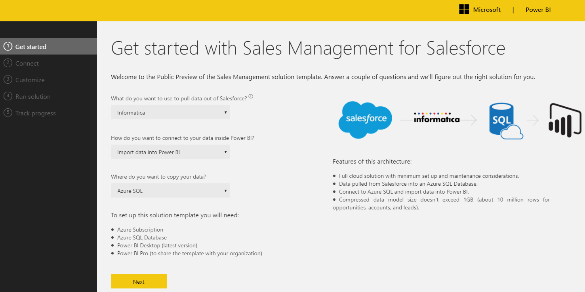
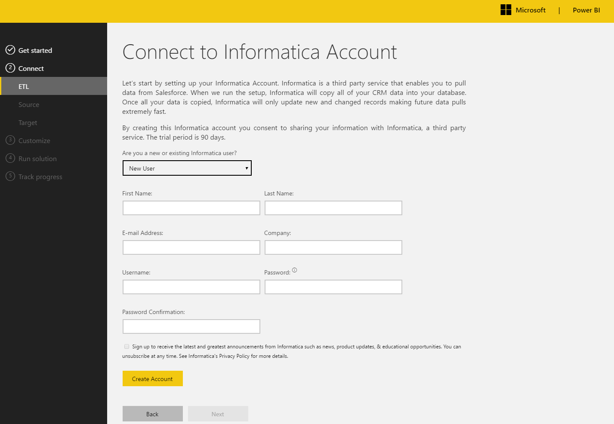
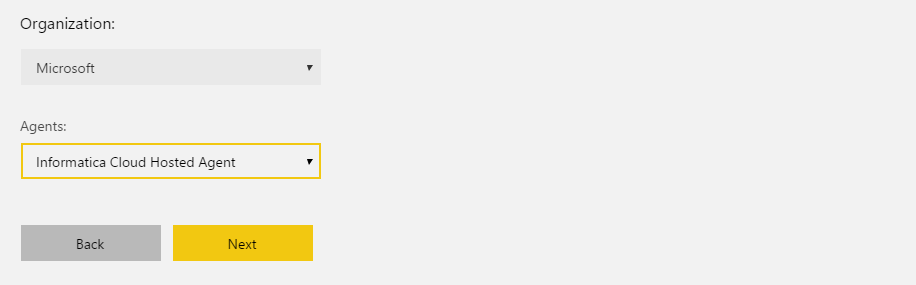
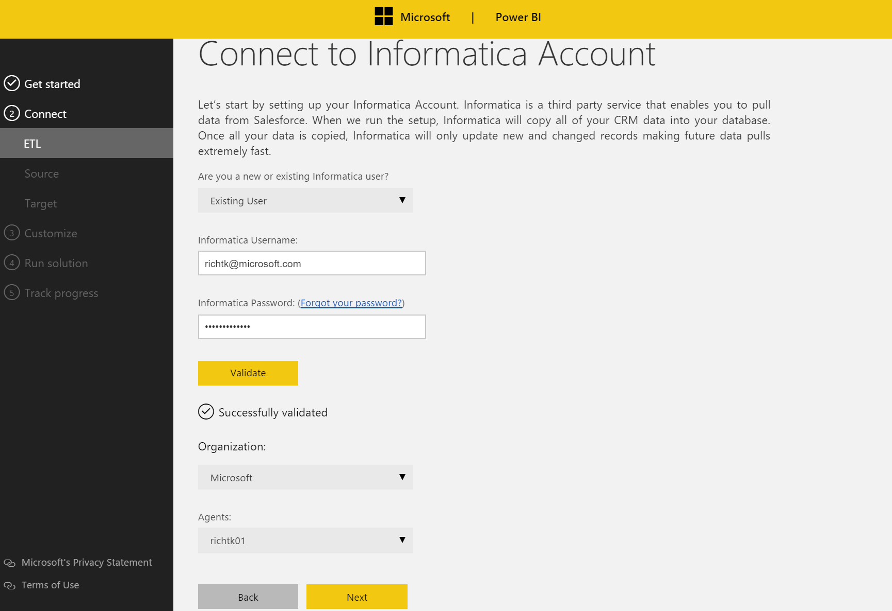
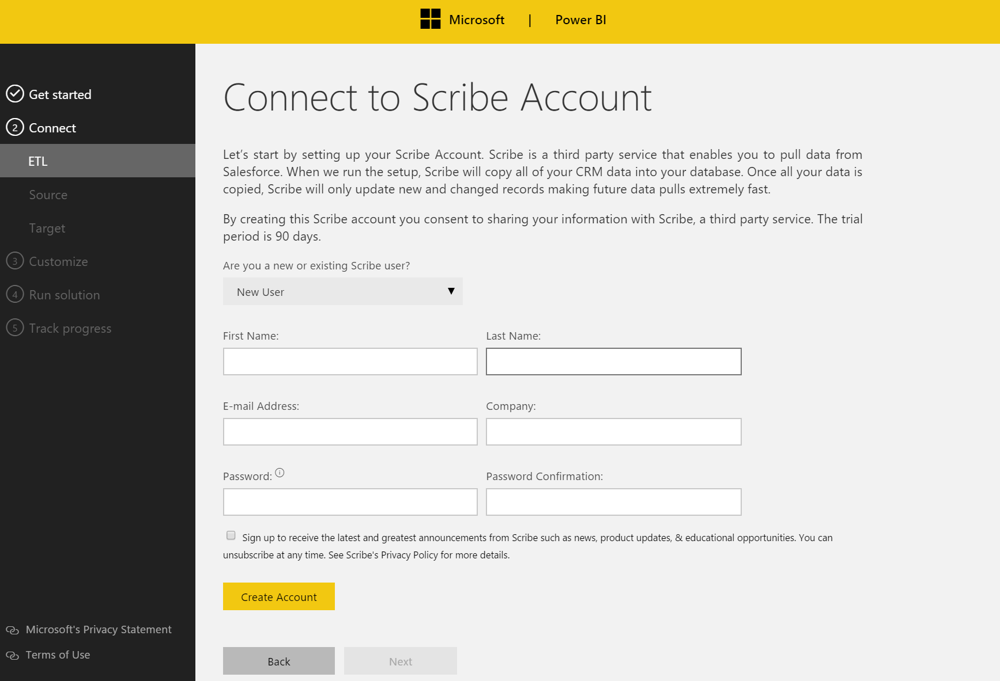
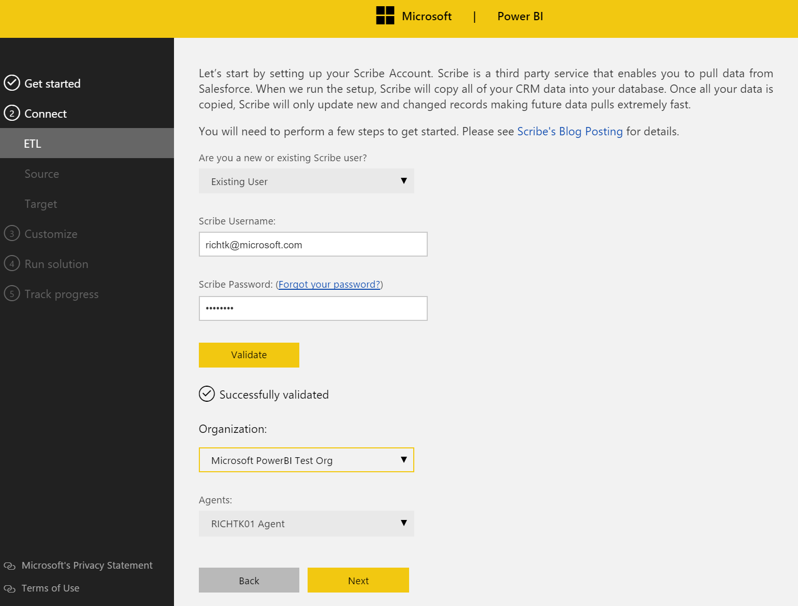
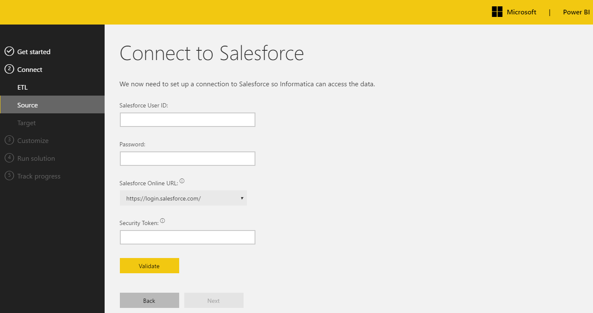
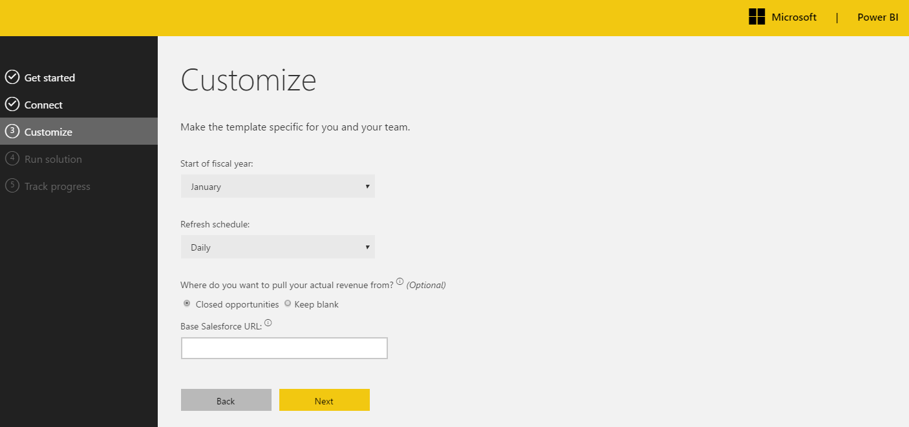
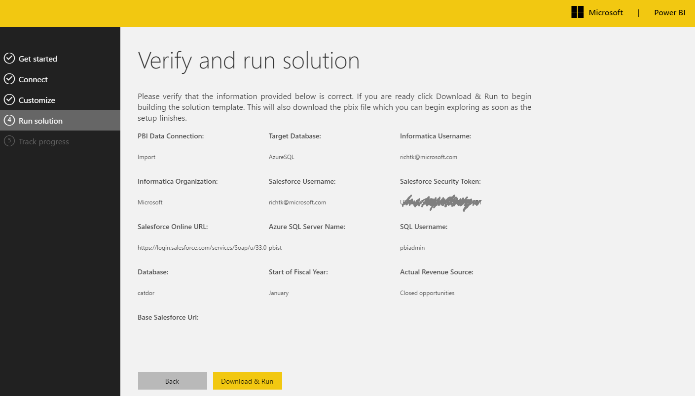
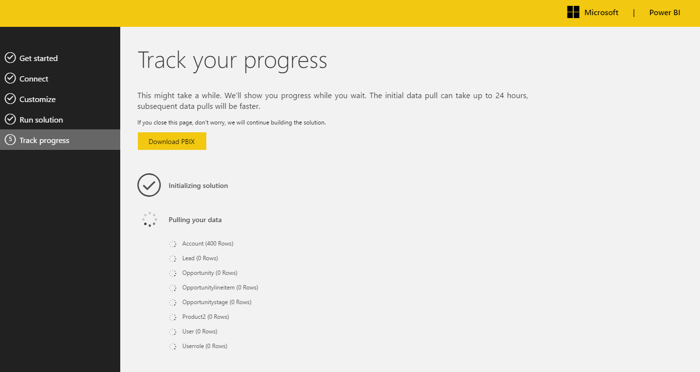

# Power BI Sales Management Solution Template for Salesforce Documentation
# Table of Contents
1. [Introduction](#introduction)
2. [Architecture](#architecture)
3. [System Requirements](#system-requirements)
4. [How to Install](#how-to-install)
5. [Technical Description](#technical-description)
6. [Report Walkthrough](#report-walkthrough)

# Introduction
Create a scalable, secure and flexible PowerBI dashboard on Salesforce with the Power BI Sales Management solution template for Salesforce. The template creates everything required for an end-to-end analytics solution on your Salesforce org including the data extraction, database constructs, and a Power BI report bound to the database. You can extend or customize the result to accommodate your own business requirements.
The Sales Management solution template for Salesforce is intended for customers who:
-	Want to provision an analytics solution for tens or even thousands of users
-	Want to deploy an analytics solution that scales with any size of Salesforce instance from small to very large
-	Want to be able to create data mashups on Salesforce with data from their ERP, marketing, inventory management or other any other application
The Sales Management solution template for Salesforce is targeted at sales executives, managers and sales professionals to forecast revenue, compare sales to the same period in the prior month, quarter or year, track sales against goals and monitor their pipeline .
This document describes how to provision the Sales Management solution template for Salesforce, the architecture, and how to extend or customize the template. The audience for this document is intended to be the IT professional or administrator who implements and manages the solution template and/or the developer who extends or customizes the solution template.
Please contact <PBISolnTemplates@microsoft.com> for any questions or issues with this document.

# Architecture
There are two architectures supporting the solution template:
-	Import data into Power BI
-	Live connection from Analysis Services

In both architectures, new and changed records are pulled from Salesforce to populate a SQL database (how data is pulled and SQL database are described in later sections) after which the approach differs.

The Import data into Power BI option (henceforth termed the import option) is where the data is pulled out of the SQL database to populate the model in Power BI. On every refresh, all the data is pulled out of the SQL database to refresh the Power BI model. When the model is published to Power BI, the data will be resident in the Power BI service:


The Live Connection from Analysis Services (henceforth termed the AS option) is where the data is pulled from the SQL database to populate an Analysis Services tabular model. The Power BI reports are bound to the Analysis Services tabular model instead of directly to the SQL Database.


When the model is published to Power BI, the data stays in Analysis Services and does not move with it to the Power BI service. Viewing published reports results in queries sent to Analysis Services from the Power BI service:
The Import option is recommended when:
-	The amount of data in Power BI is less than the 1 GB limit (remember, this is a compressed size representing a data volume roughly 10x this size, or 10GB of Salesforce data.

The AS option is recommended when:
-	The amount of data in Power BI is greater than 1 GB or might be greater than 1 GB in the future.
-	You want your data to stay in your control and not move to Azure when the Power BI reports are published.
-	You want the data available for reporting with other tools in addition to Power BI that can take advantage of Analysis Service's capabilities.

If you're in doubt, choose the Import option. It's simpler.

# System Requirements
Setting up the template requires the following:
-	SQL Server Database 2008 R2 or later, or an Azure Subscription with an Azure SQL Database
-	Power BI Desktop (latest version)
-	Power BI Pro (to share the template with others)
-	A Salesforce account
-	SQL Server Analysis Services 2008 R2 (only required for the AS option). Note that in SQL Server 2016, the Standard edition can be used for the solution template. For earlier versions, Enterprise edition is required. More details on SSAS tabular model features available in SQL Server 2016 can be found [here](https://msdn.microsoft.com/en-us/library/cc645993.aspx).

# How to Install
Installing the Sales Management solution template for Salesforce configures the following:
-	Data extraction (Informatica, Scribe or Azure Data Factory)
-	SQL Server database or Azure SQL Database
-	SQL Server Analysis Services (optional)
-	Power BI Desktop file (SalesManagement.pbix)
The detailed description of each component of the architecture is below. To get started, navigate to the Power BI solution templates from the Solutions menu on powerbi.com:


From there, select the Sales Management for Salesforce solution template and click the "Install now" button.

There are three distinct flows for the installation:

**Azure SQL DB installation**: This has all the advantages of Software as a Service where you pay as you go. All the patching and upkeep is handled for you. You can also later publish your reports to PowerBi.com without having to install a gateway (more on this later).

**On-premises installation**: This encompasses the option for on-premises SQL Server and SQL Server running on an Azure virtual machine. In the first case data will be moved to an instance of an on-premises SQL Server (i.e. SQL Server on hardware you own and that you maintain). The second option consists of SQL Server running on an Azure virtual machine. In this architecture, you are responsible for all patching and upkeep.

**Analysis Services installation**: This option is the same as the on-premises installation with the addition of a dedicated tabular model.

## Step 1: Architecture Choices
There are three choices for moving the data - Informatica, Scribe or Azure Data Factory. For Informatica and Scribe one can either create a new account or use an existing one, on a later page. Both partners provide a free evaluation period of three months.

_Note: Azure Data Factory is currently only supported for Azure SQL Database._


Once the ETL provider is chosen, the architecture option is selected - the default choice is Azure SQL.

_Note: SQL Server Analysis Services is not yet supported with Azure SQL Database_

If the selected architecture requires the configuration of an on-premises SQL Server or SQL Server on an Azure virtual machine, a "Download" button appears. Click this to download an installer for the solution template.

If a dedicated Analysis Services model is preferred, please select "Live Query from Analysis Services" for question 2. Click the "Download" button at the bottom of the page to download the installer for the solution template.


## Step 2: Connect to ETL Account
### Step 2a: Connect to ETL provider for Azure SQL Destination
_Complete this step when an Azure SQL DB is used to host the Salesforce data; otherwise use step 2b._

No software need be installed when the data is moved to a SQL Azure DB. There are three providers available for Azure SQL Destination:
- Microsoft Azure Data Factory or ADF - a cloud-based data integration service that automates the movement and transformation of data.
- Informatica - Leverages the Informatica Cloud Integration Platform to move data from Salesforce to Azure SQL
- Scribe -  Uses Scribe’s cloud-based platform for Salesforce connectivity

For ADF, simply connect to Azure and the necessary services are automatically created and configured for you:


For Informatica and Scribe, a cloud agent is automatically set up and used to move the data. This makes for a simpler installation and administration in the future.



The screenshot above shows the page for creating a new Informatica account. The experience for creating a new Scribe account is the same. 

For new accounts, enter the required information. Learn more about Informatica accounts [here](https://www.informatica.com/informaticaforpowerbi) and new Scribe accounts [here](http://www.scribesoft.com/solutions/analyticsbusiness-intelligence/microsoft-power-bi/). Select "Create Account". For existing accounts, enter your credentials and click "Validate".

Select the Organization in the dropdown. Then select the "Informatica Cloud Hosted Agent" for Informatica:


For Scribe, the agent is automatically selected for you behind the scenes and is not shown.

Click "Next" to continue.

## Step 2b: Connect to ETL provider for SQL Server destination/SQL Server with SSAS
_Complete this step when an SQL Server either on-premises or in an Azure VM is used to host the Salesforce data; otherwise use step 2a._

All ETL providers require an agent to be installed to move data from Salesforce to the on-premises SQL Server or to SQL Server on an Azure VM. The agent can be installed on any machine with access to the destination but it is recommended to install the agent on the same machine.

**Informatica Instructions**
New Informatica users installing the solution template on a machine without the Informatica Cloud Secure Agent installed and registered to their account must first create an Informatica account and then install the Informatica Cloud Secure Agent on a machine that has access to destination SQL Server database.

Once the account is created, download and install the Informatica Cloud Secure Agent from [here](https://app.informaticaondemand.com/ma/).  Register the Informatica Cloud Secure Agent with your Informatica credentials.
After the Informatica Cloud Secure Agent is installed, change the "New User" selection to "Existing User" and click "Validate". The Informatica Cloud Secure Agent will appear.



_Note: The list of agents are those registered with this account - not those installed on the machine._

If the Agent does not appear, validate the installation.

Click "Next" to continue.

**Scribe Instructions**
New Scribe users must first create an account and install the Scribe Online Agent. Instructions for downloading and installing the Scribe Online Agent can be found [here](http://help.scribesoft.com/scribeonline/en/sol/agent/agentinstall.htm). Once the account is created, install the Scribe Online Agent.

_Note: the list of Scribe Online agents are those registered with this account " not those installed on the machine._

Once the ETL account is created and agent is installed, change the selection "New User" selection to "Existing User", provide your credentials and click the Validate button.



The Organization drop down will contain at least one item created by the solution template (for existing Scribe users, this will contain all Scribe organization with replication enabled).

The Installed agent should appear in the agent dropdown. If it does not, verify your installation of the Scribe online agent.

Click "Next" to continue.

## Step 3: Connect to Salesforce
Provide your Salesforce credentials to gain access to Salesforce. The security token will have been sent to you when your credentials were first created and with each password change. If you do not know this token, connect directly to Salesforce and generate a new token.
The Salesforce login URL normally does not need to be changed from the default <https://login.salesforce.com>. Change this to <https://test.salesforce.com> if you are testing against a sandbox (a copy of your production environment used for testing and development).



 Validate your credentials and click "Next".
## Step 4: Connect to SQL
### Step 4a: Connect to Azure SQL
_Follow this step for an Azure SQL database destination; otherwise, follow step 4B._

Provide your Azure SQL Database credentials to gain access to the destination Azure SQL Database.


Important note: You **_must_** safelist the IP addresses shown on this page in the Azure portal before you continue. Do not use the values from the screenshot above, but the values in the actual page. If you do not, the process will fail.
The IP addresses must be safe-listed inside Azure SQL for the following reasons:
-	To allow the solution template web application to create the database structures in the Azure SQL DB required by the solution template.
-	To allow the ETL provider to insert data into the Azure SQL DB pulled from Salesforce
-	To allow your Power BI on your client machine to read data from Azure SQL DB

If you are planning to use Power BI Desktop from a different machine than the current machine, you must discover the IP address that machine exposes to Azure and safe-list this as well.

_Special note: Your machine may not expose the same IP address to Azure that you discover via the ipconfig command._

To safe-list the IP addresses, follow the instructions [here](https://azure.microsoft.com/en-us/documentation/articles/sql-database-configure-firewall-settings/).

Enter the credentials for your Azure SQL DB, click validate, then choose the database to be used by the solution template and click "Next".

### Step 4b: Connect to SQL Server Database/SQL Server Database with Analysis Services
_Follow this step for an SQL Server database destination with or without SQL Server Analysis Services; otherwise, follow step 4a._

Provide your Azure SQL Database credentials to gain access to the destination SQL Server database. Click validate check your credentials.

If SQL Server Analysis Services (SSAS) is used, enter an existing SSAS server name and the name of a new Analysis Services database. This SSAS database will be created on your behalf.


## Step 5: Tailor your Sales Management solution template for Salesforce
Provide the starting month of your fiscal calendar. This is required for fiscal year calculations in the Power BI file.



Define how often the data is refreshed from Salesforce. Note that the initial extraction can take some time - even up to a day. Once that is complete, subsequent extractions pull new and changed records only and complete very quickly.

There are two options for how actual revenue is handled by the solution template:
-	Pulled from closed opportunities. When an opportunity is closed in Salesforce, the revenue for the actual sale can be provided. This is the default source for actual revenue
-	Keep blank. If actual revenue is to be pulled from a separate source such Dynamics CRM, SAP or some other application, choose this option. After you install the solution template, you can create a separate mechanism to populate these values (refer to the separate section on the data schema for where this data is to be populated).

If you provide the base Salesforce URL, hyperlinks are created for each opportunity, lead and account to enable linking from Power BI reports directly into the related Salesforce object; e.g.
<https://na30.salesforce.com>.

When ADF is selected as the ETL provider, an additional field will be made available for emails. This is optional, and configures an alert system to notify the user if slices have failed.

Click "Next" to continue.

## Step 6: Validate the information provided
Scrutinize the information provided for errors. If everything is correct, click "Download & Run" to create the solution template.



## Step 7: Track your progress
This page tracks your progress. Once the data starts to move, this page can be closed and the data will continue to be copied.
Click the "Download PBIX" button to download a Power BI file, SalesManagementReport.pbix, that is bound to the chosen SQL Azure database.



## Step 8: Open the Power BI file
### Step 8a: Power BI Import from Azure SQL or SQL Server Database
If the data was imported directly into Power BI, proceed; otherwise skip to step 8b.
Open the downloaded Power BI file and take the following steps:
a)	Click "Apply Changes"

b)	Windows Credentials
On the windows tab, select "Use my current credentials":

c)	Database Credentials
Click the Database item in the left-hand pane and enter the username and password you provided for the Azure SQL database:

Click "Save".

### Step 8b: Power BI Live Connection to Analysis Services
_If the Power BI file is connected to SQL Server Analysis Service, proceed; otherwise follow the instructions in step 8a._

Open the Power BI file. ON the Home menu tab, select Edit Queries, then Data Source Settings:

Enter the Server and Database name entered in the previous step and click OK. The Navigator dialog will appear:

Click OK to view the report.
## Step 9: View the Report
At this point Power BI Desktop will connect and retrieve the data. Note that it may take some time for the initial data pull to finish.  

## Common Provisioning Questions
**I closed the "Track your Progress" page. How do I know when the data has been pulled out of Salesforce?**
You can connect to the ETL provider to track progress. For Informatica, connect to https://app.informaticaondemand.com/ma/  and use the credentials you provided in the Connect to ETL Account step. For Scribe, connect to <https://online.scribesoft.com/ScribeOnline.aspx#/Logon>.

For ADF, the status of the slices can be viewed through the Azure Portal- through the Data Factory Monitor and Manage view.

**I didn't download the Power BI file (the pbix file) but closed the "Track your Progress" page where it is downloaded from. Now what?**
Whoops. You'll have to repeat the provisioning process.

**I want to change how often data is extracted from Salesforce. How do I do that?**
Connect to your ETL provider:
- Informatica: <https://app.informaticaondemand.com/ma/>
- Scribe: <https://online.scribesoft.com/ScribeOnline.aspx#/Logon>.

Edit the replication task and change the schedule. Instructions for your ETL provider are beyond the scope of this document, but this is a simple matter of altering a schedule.

# Technical Description
This section describes each component of the solution template in detail.


## Azure Data Factory
When Azure Data Factory is selected as the extraction and load option, a number of resources are provisioned in the selected subscription:

-   Linked Services
-   Input and Output Datasets
-   Historical and Incremental pipelines
-  Alert to notify on failed slices (Optional)

### Linked services
There are 2 linked services created during the deployment.

|Linked Service | Description |
|-----          | ------------|
|Salesforce | The Salesforce linked service creates a connection to the Salesforce instance using a username, password and token. This requiers that the "Web API" permission set is enabled for that user in the Salesforce instance. [Enable API Access in Salesforce](https://www.data2crm.com/migration/faqs/enable-api-access-salesforce-permission-set/) |
|Azure SQL| The Azure SQL linked service created a connection to the database specified or created during configuration.|

### Input and Output Datasets
For each object that is being extracted out of Salesforce we create 2 datasets per type of pipeline (Historical and Incremental), totalling 4 datasets per object.

Once deployed, the datasets adhere to the following naming convention:
-   Historical - PreDeployment\_[TableName]\_[Input|Output]
-   Incremental - PostDeployment\_[TableName]\_[Input|Output]

The format for each dataset is determined at deployment time by querying the table metadata in Salesforce.

### Historical and Incremental Pipelines
For each object that is being extracted out of Salesforce we create 2 pipelines - Historical an Incremental.

The pipeline configuration will vary on the edition of Salesforce that the template is deployed against.

For Salesforce editions with a Concurrent API Request limit of 5, the configuration will include a mix of [OneTime and Scheduled pipelines](https://azure.microsoft.com/en-gb/documentation/articles/data-factory-create-pipelines/). Both OneTime and Scheduled pipelines will be chained together, ensuring the concurrency limit of 5 is not breached. All incremental pipelines are deployed as Scheduled and chained together.

For Salesforce editions with a maximum Concurrent API Request limit (25) the pipelines are deployed with no dependency between them and run in parallel.

If "None" was selected as the frequency for incremental pulls, the incremental pipelines will be deployed but in a "Paused" state.

### Copy Activity
Each pipeline is underpinned by a Copy Activity that queries the source (Salesforce) and calls a stored procedure in Azure SQL to store the data.

The query that gets executed is dynamically created for each object based on the metadata extracted from Salesforce. Each query is parametrized using the WindowStart and WindowEnd values. These represent the start and end times of a given activity slice.

~~~
$$Text.Format('SELECT Id, OpportunityId, SortOrder, PricebookEntryId, Product2Id, ProductCode, Name, Quantity, TotalPrice, UnitPrice,
ListPrice, ServiceDate, Description, CreatedDate, CreatedById, LastModifiedDate, LastModifiedById, SystemModstamp, IsDeleted FROM
OpportunityLineItem WHERE (IsDeleted = FALSE OR IsDeleted = TRUE) AND ((CreatedDate > {0:yyyy-MM-ddTHH:mm:sssZ} AND CreatedDate <=
{1:yyyy-MM-ddTHH:mm:sssZ}) OR (LastModifiedDate > {0:yyyy-MM-ddTHH:mm:sssZ} AND LastModifiedDate <= {1:yyyy-MM-ddTHH:mm:sssZ}))',
WindowStart,WindowEnd)
~~~

Each activity has the same configuration, displayed below.

```json
"policy": {
                    "timeout": "02:00:00",
                    "concurrency": 1,
                    "executionPriorityOrder": "NewestFirst",
                    "style": "StartOfInterval",
                    "retry": 2,
                    "longRetry": 5,
                    "longRetryInterval": "01:00:00"
                }
```

In the case of Scheduled pipelines, the policies can easily be tailored to suit more specific needs. For OneTime pipelines, they need to be redeployed with a modified policy (the deployment template can be found under ResourceGroup deployments).

For a higher throughput for the historical load for example, the concurrency parameter can be set to a maximum of 8, meaning that for every object being loaded from Salesforce, there can be a maximum of 8 slices running at the same time.

## Customization
New pipelines and datasets can be added to the created data factory. The recommended way of adding such customizations is through the [copy wizard](https://azure.microsoft.com/en-us/documentation/articles/data-factory-copy-data-wizard-tutorial/).

The necessary linked services, Salesforce and Azure SQL will already be created and available for use with new pipelines.

To ensure consistency in the data, a stored procedure should be used to insert data into SQL.

Before the pipeline is configured using the copy wizard, the target SQL table and stored procedure should be present in the database.


## Data Extraction and Load
The sales management solution template utilizes Informatica or Scribe replication jobs, or ADF pipelines to move the data. The following tables are replicated:
-	Account
-	User
-	Lead
-	Opportunity
-	OpportunityLineItem
-	OpportunityStage
-	Product2
-	UserRole

The tables are replicated with custom fields already included.
Additional entities can be replicated to the target database. Refer to Informatica or Scribe for instructions to add additional entities to the replication or modify the replication schedule.

## SQL Server DB - SQL Server or Azure SQL Database
### Tables
Tables replicated from Salesforce are replicated to the dbo schema. Other tables and any other objects are created in the schema smgt.

The following additional tables are added to the target database.

<sub>

| Table         |	Description |
| -----         | ------------  |
| ActualSales	| An empty table for the installer to copy actual sales data. This table is used to source actual sales if the solution template is configured to do so.       |
|Configuration	| Contains the values to configure the solution template. |
|Date			|A calendar table created for time analysis with a day granularity.|
|Quotas			|An empty table for the installer to copy quota data. |
|UserMapping |	Maps salesforce users to domain users. The installer is responsible for populating this table.|

</sub>


### ActualSales Table

<sub>

| Column         | Datatype     |	Description |
| ---------------|--------------|--------------|
| InvoiceID	     | varchar(50)	 | Identifier for the actual sales value. |
| ActualSales    | decimal(18,0)	 | Value of the actual sales |
| InvoiceDate	 | date	 | Date sales revenue invoiced
| AccountId      | varchar(50)	 | Identifier matching account Id from salesforce |
| ProductID      | varchar(50)	 | Identifier matching product Id from salesforce. This is optional " sales do not have to be assigned to a product |

</sub>

### Configuration Table

<sub>

| Column         | Datatype     | Description |
| ---------------|--------------|--------------|
| id	                 | int		        | Identifier for configuration value |
| configuration_group	 | 	varchar(150)	|  	Mechanism for grouping config values |
| configuration_subgroup | 	varchar(150)	| Mechanism for grouping config values |
| Name		             | varchar(150)	    | 	The name of the configuration value |
| Value		             | varchar(max)	    | 	|
| Visible	             | bit	            | Whether or not the configuration value is visible in the Power BI reports. |

</sub>

The values in the configuration table are defined below:

<sub>

| configuration_group	| configuration_subgroup | name               | Description |
| ----------------------|------------------------|--------------------|-------------|
| SolutionTemplate      |   SalesManagement	     | version	          |             |
| SolutionTemplate      |	SalesManagement	     | BaseURL	          | The URL for Salesforce content. If populated, drill through to Salesforce objects is enabled; eg, <https://na30.salesforce.com> |
| SolutionTemplate      |   SalesManagement	     | FiscalMonthStart   | Numeric value of fiscal month designating the beginning of the fiscal year. Expected values 1 through 12 |
| Data	                |   actual_sales	     | Enabled	          | Indicates where source of actual sales. Supported values: 0: Opportunities 1: ActualSales table (installer is responsible to populate) |
| SolutionTemplate	    |    SalesManagement	 | Source	          | Indicates source application. Do not change. |

</sub>

### Date

The Date table is autogenerated with the installation of the solution template from 2013 to 2020.

<sub>

| Column         | Datatype     | Description |
| ---------------|--------------|--------------|
| date_key      | 	int	      | Numeric datekey in the format yyyymmdd |
| full_date      | 	date	      |  |
| day_of_week      | 	tinyint	      | Day of week " 1 though 7 |
| day_num_in_month      | 	tinyint      | 	Day of month " 1 through 31 |
| day_name      | 	char(9)      | The day name. can be edited to localize |
| day_abbrev      | 	char(3)      | 	Day abbreviation; eg, Mon for Monday |
| weekday_flag      | 	char(1)      | 	y for weekday, n for weekend |
| week_num_in_year      | 	tinyint      | 	Week numer in year ranging from 1 to 52 |
| week_begin_date      | 	date      | 	The date of the beginning of the week for the current date |
| week_begin_date_key      | 	int      | 	The date key of the beginning of the week for the current date |
| month      | 	tinyint      | Month number raning from 1 through 12. |
| month_name      | 	char(9)      | 	Long month name; eg, January |
| month_abbrev      | 	char(3)	      | Short month name; eg, Jan |
| quarter      | 	tinyint	      | Calendar quarter number, from 1 through 4 |
| year	      | smallint       | Year number; eg, 2017 |
| yearmo      | 	int      | Year  and month number; eg, 201703 for March, 2017 |
| last_day_in_month_flag      | 	char(1)      | Set to n if not the last day in the calendar month, set to y for last day in calendar month. |
| same_day_year_ago_date      | 	date      |  |
| same_day_year_ago_key      | 	int	      |  |
| day_num_in_year      | expression      | 	Number of the current day in the calendar year. |
| quarter_name      | 	expression      | 	Name of the current calendar quarter; eg, Q1 |

</sub>

### Quotas
The Quotas table is initially empty. It is the responsibility of the implementer to populate this table and to keep it up to date.

<sub>

| Column         | Datatype     | Description |
| ---------------|--------------|--------------|
| Amount      | decimal(18,0)      | Quota amount |
| Date      | date      | The date the quota applies to " generally the first day of the month |
| OwnerId      | varchar(50)      | Salesforce OwnerID of the quota. |
| ProductId      | varchar(50)      | Salesforce ProductID of the quota |

</sub>

### UserMapping
The UserMapping table is populated during data transfer.  The contents of this table are used if row level security is implemented. Otherwise it can be ignored.

<sub>

| Column         | Datatype     | Description |
| ---------------|--------------|--------------|
| UserID      | varchar(50)      | Salesforce UserId |
| DomainUser      | varchar(50)      | The domain name for each user. This does not come from Salesforce but is derived during the data load process. Refer to the SQL Agent section.  |

</sub>


## Views
The Power BI file or, optionally, SSAS is bound to the views. These are defined below:

### AccountView
AccountView is bound to the Account table.

<sub>

| Column         | Datatype           |  Source      | Description  |
| ---------------|--------------------|--------------|--------------|
| [Acccount Id]  | 	nvarchar(18)      | Id    |          |
| [Account Name]      | 	nvarchar(255)      | 	Name	|    |
| [Owner Id]      | 	nvarchar(18)      | 	ownerId	 | |
| Industry      | 	nvarchar(40)      | 	Industry | |
| [Business Unit  Id]      | 	int      | 	n/a |	Always null |
| City      | 	nvarchar(40)      | 	BillingCity	 | |
| State	      | nvarchar(80)      | 	BillingState	 | |
| Country      | 	nvarchar(80)      | 	BillingCountry	| |
| [Annual Revenue]      | 	Float      | AnnualRevenue	| |

</sub>


### ActualSalesView
ActualSalesView is bound to either the ActualSales table or to closed opportunities depending on the value of the actual_sales configuration row in the configuration table.

<sub>

| Column         | Datatype           |  Source      | Description  |
| ---------------|--------------------|--------------|--------------|
| [Invoice Id]	 | nvarchar(50)	 | ActualSales.InvoiceID <br/> or <br/> Opportunity.OpportunityId | Id changes based on source of actuals data |
| [Actual Sales]	 | 	float	 | ActualSales.ActualSales <br/>or, <br/>if no OpportunityLineItems exist, <br/> Opportunity.Amount <br/> otherwise,<br/> OpportunityLineItem.TotalPrice	| Whether or not actual sales are related to a product depends on whether the content of the ActualSales are tied to a product or whether the OpportunityLineItems exist in Salesforce. |
| [Invoice Date]	 | 	datetime	 | ActualSales.InvoiceDate <br/> or <br/> Opportunity.ClosedDate | |
| [Account ID]	 | 	nvarchar(50) | ActualSales.AccountId <br/> or <br/> Opportunity.AccountId | |
| [Product Id]	 | nvarchar(50) | 		ActualSales.ProductId <br/> or,<br/> if no OpportunityLineItems exist <br/> Null, <br/> otherwise <br/>  OpportunityLineItem.ProductId | |

</sub>

### BusinessUnitView
This view is populated from the UserRole table. It is "flattened" from the recursive source. That is, instead of a recursive parent child relationship, the first three levels are separate columns.

<sub>

| Column         | Datatype           |  Source      | Description  |
| ---------------|--------------------|--------------|--------------|
| [Business Unit Id]	 | 	nvarchar(18)	 | 	UserRole.ID	| |
| [Business Unit Name]	 | 	nvarchar(80)	 | 	Name	| |
| Level	 | 	int	 | calculated | 0-based level depth where 0 represents top level.|
| Level1	 | 	nvarchar(80)	 | | The top level of the business unit. This is always populated
| Level2	 | 	nvarchar(80)	 | | The second level of the business unit where level>1, otherwise null
| Level3	 | 	nvarchar(80)	 | | The thrird level of the business unit where level>2, otherwise null

</sub>

Note that business units recursing deeper than third level are not included and are included as the third level.

### ConfigurationView
This view is exclusively populated from the smgt.Configuration.

<sub>

| Column         | Datatype           |  Source      | Description  |
| ---------------|--------------------|--------------|--------------|
| Id | int | Id | Values are only included in the view if visible=1 |
| [Configuration Group] | varchar(150) | configuration_group | |
| [Configuration Subgroup] | varchar(150) | configuration_subgroup	| |
| Name | varchar(150) | name | 	|
| Value | varchar(max) | value	 |  |

</sub>

### DateView
All Dateview columns are exclusively from the Date table.

<sub>

| Column         | Datatype           |  Source      | Description  |
| ---------------|--------------------|--------------|--------------|
| date_key | char(150) | [full_date]	 |  |
| [Day of the Week] | tinyint | [day_of_week] | |
| [Day Number of the Month] | tinyint | [day_num_in_month]	 | |
| [Day Name] | char(9) | [day_name] | Long day name; eg, Monday |
| [Day Abbreviated] | char(3) | [day_abbrev] | Short day name; eg, Mon |
| [Weekday Flag] | char(1) | [weekday_flag]	 | |
| month | tinyint | month | integer month from 1 to 12 |
| [Month Name] | char(9) | month_name | Long month name |
| [month_abbrev] | char(3) | [month_abbrev]	 | |
| quarter | tinyint | Quarter | |
| Year | smallint | year |  |
| same_day_year_ago_date | date | same_day_year_ago_date | |
| [Week Begin Date] | date | [week_begin_date] | |

</sub>

### LeadView

<sub>

| Column         | Datatype           |  Source      | Description  |
| ---------------|--------------------|--------------|--------------|
| [Status] | nvarchar(255) | Status | Values are only included in the view if visible=1 |
| [Lead Quality] | nvarchar(255) | NULL | |
| [Subject] | nvarchar(300) | NULL	| |
| [Job Title] | nvarchar(100) | Title | |
| [Lead Id] | nvarchar(18) | Id	 |  |
| [Estimated Amount Base] | int | NULL |  |
| [Owner Id] | nvarchar(18) | OwnerId |  |
| [State Code] | int | NULL |  |
| [Campaign Id] | int | NULL | |
| [Estimated Close Date] | datetime | NULL |  |
| [Lead Source Name] | nvarchar(255) | LeadSource |  |
| [Industry Name] | nvarchar(255) | Industy	 | |
| [Purchase Time Frame] | nvarchar(255) | NULL	 |  |
| [Created On] | datetime | CreatedDate |  |
| [Company Name] | nvarchar(100) | NULL	 | |

</sub>

### MeasuresView
This is an empty table that is used as a source for calculated measures in Power BI.

<sub>

| Column         | Datatype           |  Source      | Description  |
| ---------------|--------------------|--------------|--------------|
| MeasureValues	| int | Calcuated column	| |

</sub>

### OpportunityProductview
All values in this view are taken from the opportunitylineitem table.

<sub>

| Column         | Datatype           |  Source      | Description  |
| ---------------|--------------------|--------------|--------------|
| [Product Id] | nvarchar(18) | product2id	 |  |
| [Opportunity Id] | nvarchar(18) | opportunityid	 |  |
| Revenue	 | float | totalprice	 |  |

</sub>

### Opportunityview

<sub>

| Column         | Datatype           |  Source      | Description  |
| ---------------|--------------------|--------------|--------------|
| Opportunity Id | nvarchar(18)| ID	| |
| [Opportunity Name] | nvarchar(120) | name	| |
| [Owner Id] | nvarchar(18) | ownerid | |
| [Actual Close Date] | date | closedate | The actual close date is populated only if the opportunity is closed Opportunity.isclosed=1), otherwise null |
| [Estimated Close Date] | date | closedate | The estimated close date is populated only if the opportunity is open Opportunity.isclosed=0), otherwise null |
| [Close Probability] | float | Probability	 | |
| [Account Id]	nvarchar(18) | Accountid | |
| [Actual Value] | float | Amount | The actual value is populated only if the opportunity is closed Opportunity.isclosed=1), otherwise null |
| [Estimated Value] | float | Amount | The estimated value is not updated when the opportunity is closed. Referto the [Actual Value]. |
| Status | nvarchar(40) | forecastcategoryname	 |  |
| [Sales Stage] | nvarchar(40) | stagename | |
| [Sales Stage Code] | int | sortorder  | Used to orded the salesstage values |
| State | varchar(4) | Three possible values: <br/>"Won": when isclosed=1 and iswon=1 <br/>"Lost": when isclosed=1 and iswon=0 <br/> "Open": all other cases |
| [Lead Id] | int | NULL | Leads are not associated with opportunities |
| [Opportunity Rating name] | float | probability | |
| Source | nvarchar(4) | leadsource | |

</sub>

### Productview
All values are sourced from the Product2 table.

<sub>

| Column         | Datatype           |  Source      | Description  |
| ---------------|--------------------|--------------|--------------|
| [Product Id] | nvarchar(18) | ID	 | |
| [Product Name] | nvarchar(120) | name	 | |
| Level | int | 1 | Value is always 1 |
| [Product Level 1] | nvarchar(40) | Family	 | |
| [Product Level 2] |  nvarchar(255) | Name	 | |
| [Product Level 3] |  |  |  Not used. Always null |

</sub>

### Quotaview
All values are bound to the quota table (which is created by the solution template and not sourced from Salesforce.

<sub>

| Column         | Datatype           |  Source      | Description  |
| ---------------|--------------------|--------------|--------------|
| Amount | decimal(18,0) | Amount |  |
| Date | date | Date |  |
| OwnerId | varchar(50) | OwnerId |  |
| ProductId | varchar(50) | ProductId | |

</sub>


### UserAscendantsview
This view is used for row level security. It contains a row for every combination of individual another person one or more levels above in the reporting hierarchy as defined by the role the user has been assigned to. For example, consider when person A reports to person B who reports to person C. This table will contain:

<sub>

| User | Ascendant User |
|------|----------------|
| A | A |
| A | B |
| A | C |
| B | B |
| B | C |
| C | C |

</sub>

_Note: the reporting hierarchy is taken from a user's role assignments and not the user's  ManagerID as defined in the user table. If this behavior is required, edit the UserAscendantView definition._

Security is defined so that all ascendants of an user (as defined by which users are assigned to parent role based on the UserRole table) have read permissions to records to which that user is  the owner. If the security model is customized, this view can be modified or deleted.

<sub>

| Column         | Datatype           |  Source      | Description  |
| ---------------|--------------------|--------------|--------------|
| Roleid              | nvarchar(18) | role.id | The role the user is assigned to - and that from which the ascendant relationship was derived.
| Ascendantroleid     | nvarchar(18) | role.id | The role the ascendant is assigned to
| rolename            | nvarchar(80) | role.name | The name of the role the user is assigned to
| ascendantrolename   | nvarchar(80) | role.name | The name of the role the ascendant user is assigned to
| [User Id]           | nvarchar(80) | user.id   | |
| Email               | nvarchar(128) | user.email | |
| [Ascendant User Id] |	nvarchar(80)  | user.id  | |
| [Ascendant Email]   | nvarchar(128) | user.email | |
| [Employee level]    | int	          | derived | |
| [Ascendant Domain User] | varchar(50)	 | n/a | Not used |

</sub>

## SQL Server Analysis Services
A SQL Server Analysis Services tabular model is an optional component of the Sales management solution template. The tabular model in SQL Server Management Studio is produced below:


The Connection object contains a reference and credentials to the SQL database. This can be edited if the database is changed after the initial installation.
The table objects are identical to the objects in the Power BI model and are described there.
There are two roles defined, Hierarchical Security and SQL Server Agent Security. Hierarchical Security is a DAX expression that uses the reporting relationships from Salesforce to define row level security on the Opportunity, Account and Lead objects. By default, a user can see the object values that they own or their reports (drawn from Salesforce) own. Hierarchical security depends on a view created in the destination database that unwinds the reporting structure, UserAscendantsView. This view includes a row for each user and manager combination. For example, if John reports to Margaret who reports to JoAnne, this view contains the (logical) rows:

<sub>

|User | User Ascendant |
|-----|----------------|
| John | 	Margaret |
| John | JoAnne |
| Margaret |	JoAnne |

</sub>


This table is used by SSAS to compute row level security.  For example, the DAX expression below determines if  an account is owned by a user or if it is owned by an individual who reports to that individual:
~~~~
=or(
		contains(filter('User Ascendants','User Ascendants'[Ascendant Domain user]=username()), [User Id],  'Opportunity'[Owner Id]),
		contains(filter('User Ascendants','User Ascendants'[Ascendant Domain user]=username()), [User Id],  lookupvalue('Account'[Owner Id], [Account Id], 'Opportunity'[Account Id]))
	)

~~~~

The security DAX expressions can be changed in SQL Server Management Studio or in Visual Studio.


## SQL Server Agent
If the SQL Server Analysis Services option is chosen, a SQL Server agent job entitled "Data load and processing" is created to launch the data replication process and  process the tabular model:


The SQL Server Agent Job has four steps:


The "Start solution processing" step initiates the ETL. The "Check data load" step validates that the
load succeeded. "Update domain account information" determines each user's domain name based on their email addresses (refer to table usermapping). The process SSAS database performs a full process on all tables in the SSAS tabular model.

The above steps launch PowerShell scripts found in the installation folder.

## Power BI
### Tables and Relationships
The relationships between the tables are shown in the diagram below:


### Power BI Measures
The table below lists the measures in the Power BI file:

<sub>

|Measure | Description |
|--------|-------------|
| Actual Revenue | Sum of actual revenue |
| Actual Revenue (cumul) | A cumulative sum of actual revenue |
| Actual Revenue MTD | Sum of actual revenue from the beginning of the month until today |
| Actual Revenue QTD | Sum of actual revenue from the beginning of the quarter until today |
| Actual Revenue YTD | Sum of actual revenue from the beginning of the year until today |
| Expected Revenue (cumul) | A cumulative sum of actual and open revenue  |
| Expected Revenue | A sum of actual and open revenue |
| Lost Opportunity Count | Count of lost opportunities  |
| Open Revenue | Sum of open revenue |
| Open Revenue (cumul) | A cumulative sum of open revenue |
| Pipeline Coverage % | The ratio between expected revenue and target |
| Pipeline Gap | The difference between expected revenue and quota expressed in $ |
| Quota | Sum of quota |
| Quota (cumul) | Cumulative sum of quota |
| Variance to Quota | The difference between actual revenue and quota expressed in $ |
| Variance to Quota % | The difference between actual revenue and quota expressed as a % |
| Win Ratio | The ratio between open opportunities and all open and closed opportunities (won + lost) |
| Won Opportunity Count | Count of won opportunity |
| YOY Growth | Percentage change in YTD actual revenue vs. the same period last year |
| YOY Month Growth | Percentage change in MTD actual revenue vs. the same period last year |
| YOY Quarter Growth | Percentage change QTD actual revenue vs. the same period last year |

</sub>

## Power BI Calculated Columns
<sub>

| Table | Column | Description |
|-------|--------|-------------|
| Account | Account Link | URL for account in Salesforce. Populated if the BaseURL is populated in the configuration table.|
| Date | Fiscal Day Number	The day of the fiscal year |
| | Fiscal Month Name | Name of the fiscal month |
| | Fiscal Month Number	 |  |
| | Fiscal Quarter | Fiscal quarter in format of of FYyy Qq, eg, FY17 Q2 |
| | Fiscal Quarter Number	 |  |
| | Fiscal Week | Numeric fiscal week from 1 to 52 |
| | Fiscal Year | Four digit fiscal year |
| Opportunity | Close Date | The estimated or actual close date (depending on whether the opportunity is open or closed)
| | Opportunity Link | Link back to Opportunity in Salesforce. Populated if the BaseURL is populated in the configuration table.
| User | Org Level 1 | Highest level parent of the current user in the reporting hierarchy.
| | Org Level 2      | Second highest level parent of the current user in the reporting hierarchy
| | Org level 3      | Third highest parent of current user.
| | Org Level 4      | Fourth highest parent of current user.
| | Path             | Comma separated list of all parents of the current user starting with the highest and continuing until the current.

</sub>

# Report Walkthrough

The aim of this section is to walk through the Sales Management Solution Template.

Sales Managers manage anywhere between a few individual salespeople to many sales teams with multiple levels of hierarchy. Sales teams use CRM to input information about the open opportunities they are working on and use an ERP system to track actual sales (i.e. all of the opportunities the sales team(s) have closed). Performance is measured against quotas set against salespeople and/or products.

Sales Managers are interested in tracking overall performance and progress but also want to see how sales teams or even individual sales people are performing. When measuring progress, it is important to see all data  such as open revenue, closed revenue and quotas together in one place. This allows them to answer key questions like:
-	Which opportunities did I lose yesterday? Which of those was I expecting to win?
-	How much actual sales have I closed this month? How does this compare to the same time period last year or the year before?
-	How much pipeline coverage do I have for this quarter? How does this differ by sales team and product?
-	How much variance to quota do I have by sales team?
-	What does my win loss ratio look like for my worst performing product?

The next few pages go through a detailed walkthrough of each page of the Sales Management reports. They include a high-level aim of the page, a description as well as screenshots.

## Daily View
The purpose of the Daily report is for Sales Managers to view detailed information about important things that change on a daily basis.

The "Daily View" page is split into two key sections: "Retrospective" and "Looking Ahead".


The "Retrospective" View is concerned about reporting on things that have already happened this quarter. There are two key tables to focus on " the revenue a team has brought in this quarter and the opportunities that have been lost this quarter. On the left hand side one can see the "Variance to Prior Day" metric. This provides a quick indicator of how sales have changed since yesterday.

"Looking Ahead" on the other hand, is concerned with the opportunities that remain open this quarter. It provides details on who owns a given opportunity, how much it's worth and when should it close. A key metric given on the left hand side is how much revenue is in the pipeline.

An important aim of the "Daily View" however, is to give a Sales Manager the finest level of granularity they may wish to view their data by. Whilst the default report page looks at things on a quarter level, a Sales Manager may be interested in seeing the opportunities that were lost this week or the opportunities that are expecting to close tomorrow. By using the time slicers present on the page, a Sales Manager can view their data at a month, week or day level. The slicers at the top of the page update the "Retrospective view (i.e. the past), whereas the slicers in the second half of the page update everything "Looking Ahead".


## Sales Performance
The purpose of the Sales Manager page is to use historical data to evaluate the current performance of one or more sales teams.


The Sales Performance view helps Sales Managers answer questions about how their teams are performing compared to previous years. The right-hand side of the page looks at Year to Date sales (i.e. all sales that have occurred between today and the beginning of the year). It then contrasts these sales with sales for the same time period but in previous years. In the screenshot one can thus see sales for the first 7 weeks of the year compared to the first 7 weeks in 2015 and 214. One can then also view important high level metrics around revenue made this year as well as growth compared to last year.

The middle graph shows the same information at a quarter view whereas the left-hand graph looks at month to date sales. In our example above, month-to-date and year-to-date sales are the same. This is because this is still in the first quarter of the year. The month-to-date view on the other hand, shows a different picture. Here we are looking at the first 11 days of February (our current month) and comparing them to the first 11 days of February in 2015 and 2014.

Finally, the slicers at the top of the page include all of the Sales Managers direct reports (salespeople or sales team managers). A Sales Manager is thus able to select a specific sales team and look at their sales performance compared to not only their previous year performances but also the global average for the Sales Manager's teams.


## Pipeline View
The purpose of the Pipeline view is to monitor the health of the sales pipeline


This view focuses on the health of the sales pipeline. The main way pipeline health is evaluated is by measuring pipeline coverage (i.e. by summing up actual sales with all my open opportunities, does that compare to quota). Some sales mangers like to use percentages higher than 100% (e.g. 120%) to indicate a healthy pipeline as they assume not all opportunities will be closed. In our report, any pipeline coverage above 100% appears as green. On the report pipeline coverage is also split by sales team/salesperson and product to provide a more detailed understanding of pipeline.

In the sample report, one can see that while there is a very impressive pipeline coverage for Server Platform (nearly 500%), some of the other products have much lower pipeline coverage. As a Sales Manager, one could investigate why certain products are not generating as much interest and reprioritize the focus of the sales teams away from Server Platform to other areas. We have also enabled drilling down capabilities in the  owner and product pipeline coverage bar graphs. This means that clicking on a particular sales team will uncover all of the sales people that belong to the team, whereas clicking on a product family will uncover all the products associated with it. For example, "drilling" into Server Platform will allow one to see whether there is one product that has resulted in the huge surge of pipeline coverage for Server Platform, or whether all Server Platform products extremely popular. As one can see below, it appears to be the latter with all apart from one Server Platform product having very good pipeline coverage:


Another metric that complements pipeline coverage is "Gap to Green". Gap to green looks at how much more revenue needed in the pipeline is required to reach quota. A negative gap to green (as shown above in green) indicates one has already surpassed the amount required. The other card metrics on the report look at the amount of opportunities that have a high, medium and low likelihood of closing.

The cumulative graph in the bottom right hand corner provides some insights on the Pipeline page. The green line shows cumulative actual sales for the chosen time period (dictated by the time slicers at the top of the page). In the example above, actual sales for FY16Q1 are shown. For actual sales, an upward trending line is expected which goes flat after the current day (as actual sales cannot be made in the future). The cumulative expected revenue line shows a sum of actual sales along with my expected revenue based on open opportunity close dates. This line should perfectly overlay actual sales line (as one cannot have open revenue estimated to close in the past). Finally, a cumulative quota that goes up in monthly increments is shown (here quotas are assumed to be set monthly). A very useful question this graph helps answer is "at which point in the month/quarter/year can one expect to pass one's quota". Product and owner bar graphs can be used to cross filter the cumulative graph to answer that question about specific people or products.

Finally, a slicer above the cumulative graph depicts the probability with which an opportunity will close. 10% indicates an low probability of closing whereas 100% indicates the opposite. A Sales Manager can thus start with 100% and continue incrementing downwards until they find out which opportunities need to close in order to reach their target. In the example below, opportunities that have 100% close probability for Azure are viewed:


